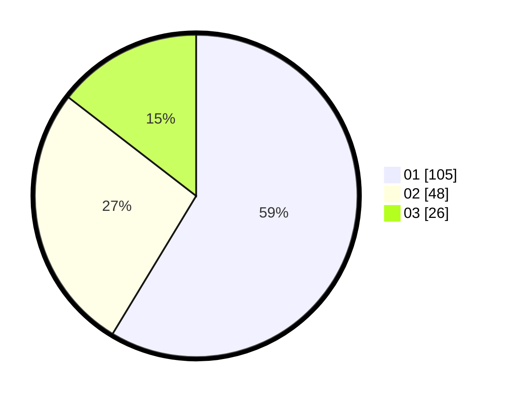

# Hasil

Hasil perolehan suara paslon dapat dilihat pada file paslon-01.txt, paslon-02.txt, dan paslon-03.txt.

Jika tidak ada, artinya data tersebut belum ada pada SIREKAP.

## Perolehan Suara

 * Paslon 01: **105**.
 * Paslon 02: **48**.
 * Paslon 03: **26**.

## Foto C Plano

https://sirekap-obj-formc.kpu.go.id/feef/pemilu/ppwp/31/73/08/10/05/3173081005113-20240214-191214--127391a0-3b64-4da6-9a15-68d5b89edc5c.jpg

https://sirekap-obj-formc.kpu.go.id/feef/pemilu/ppwp/31/73/08/10/05/3173081005113-20240214-191223--49053fab-d65f-4439-bc61-121c99ff22da.jpg

https://sirekap-obj-formc.kpu.go.id/feef/pemilu/ppwp/31/73/08/10/05/3173081005113-20240214-191248--ad0f2f6e-211e-4371-a635-ac43838b2f59.jpg

## DATA PEMILIH TETAP

Jumlah pemilih dalam DPT: **216**.
 * L: **113**.
 * P: **103**.

## DATA PENGGUNA HAK PILIH

Jumlah pengguna hak pilih dalam DPT: **176**.
 * L: **88**.
 * P: **88**.

Jumlah pengguna hak pilih dalam DPTb: **1**.
 * L: **1**.
 * P: **0**.

Jumlah pengguna hak pilih dalam DPK: **6**.
 * L: **3**.
 * P: **3**.

Jumlah pengguna hak pilih: **183**.
 * L: **92**.
 * P: **91**.

## JUMLAH SUARA SAH DAN TIDAK SAH

JUMLAH SELURUH SUARA SAH: **179**.

JUMLAH SUARA TIDAK SAH: **4**.

JUMLAH SELURUH SUARA SAH DAN SUARA TIDAK SAH: **183**.
