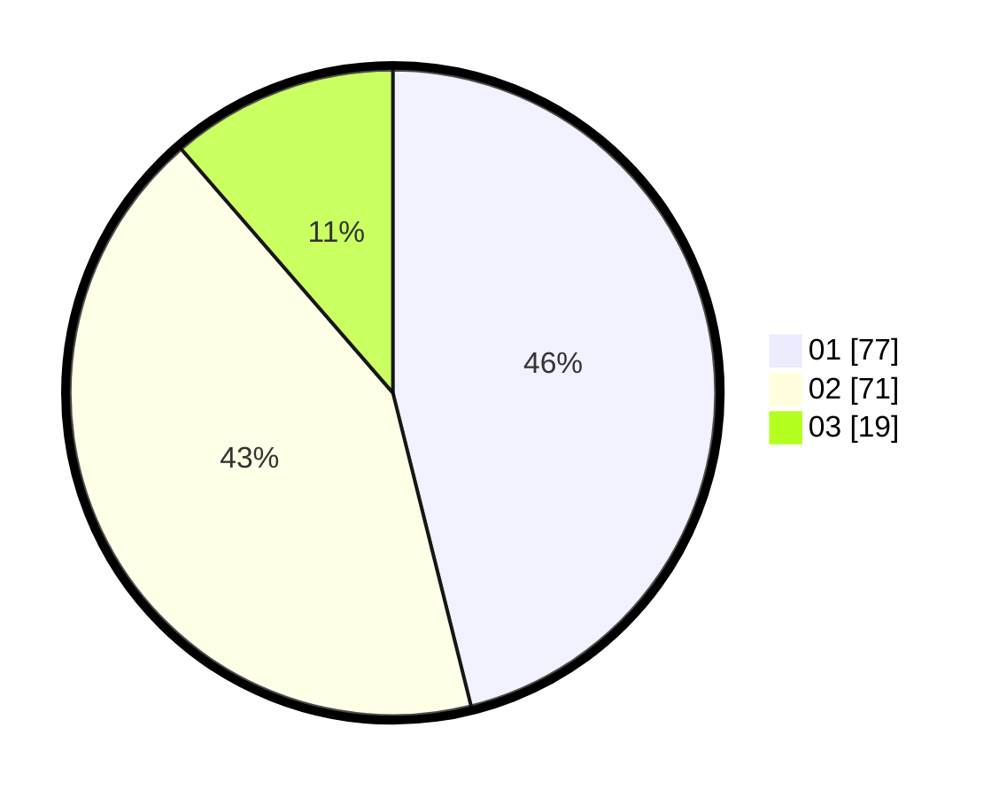

# Hasil

Hasil perolehan suara paslon dapat dilihat pada file paslon-01.txt, paslon-02.txt, dan paslon-03.txt.

Jika tidak ada, artinya data tersebut belum ada pada SIREKAP.

## Perolehan Suara

 * Paslon 01: **77**.
 * Paslon 02: **71**.
 * Paslon 03: **19**.

## Foto C Plano

https://sirekap-obj-formc.kpu.go.id/fce3/pemilu/ppwp/31/73/08/10/05/3173081005114-20240214-194442--020b4ca4-2392-4f94-b67b-722bbebfd7e7.jpg

https://sirekap-obj-formc.kpu.go.id/fce3/pemilu/ppwp/31/73/08/10/05/3173081005114-20240216-103730--8618b144-98ea-412b-833c-0f4dc561fe8b.jpg

https://sirekap-obj-formc.kpu.go.id/fce3/pemilu/ppwp/31/73/08/10/05/3173081005114-20240214-195705--207ac7f3-6644-4e06-aebf-dd34014256bd.jpg

## DATA PEMILIH TETAP

Jumlah pemilih dalam DPT: **211**.
 * L: **100**.
 * P: **111**.

## DATA PENGGUNA HAK PILIH

Jumlah pengguna hak pilih dalam DPT: **160**.
 * L: **74**.
 * P: **86**.

Jumlah pengguna hak pilih dalam DPTb: **1**.
 * L: **0**.
 * P: **1**.

Jumlah pengguna hak pilih dalam DPK: **7**.
 * L: **3**.
 * P: **4**.

Jumlah pengguna hak pilih: **168**.
 * L: **77**.
 * P: **91**.

## JUMLAH SUARA SAH DAN TIDAK SAH

JUMLAH SELURUH SUARA SAH: **167**.

JUMLAH SUARA TIDAK SAH: **1**.

JUMLAH SELURUH SUARA SAH DAN SUARA TIDAK SAH: **168**.
