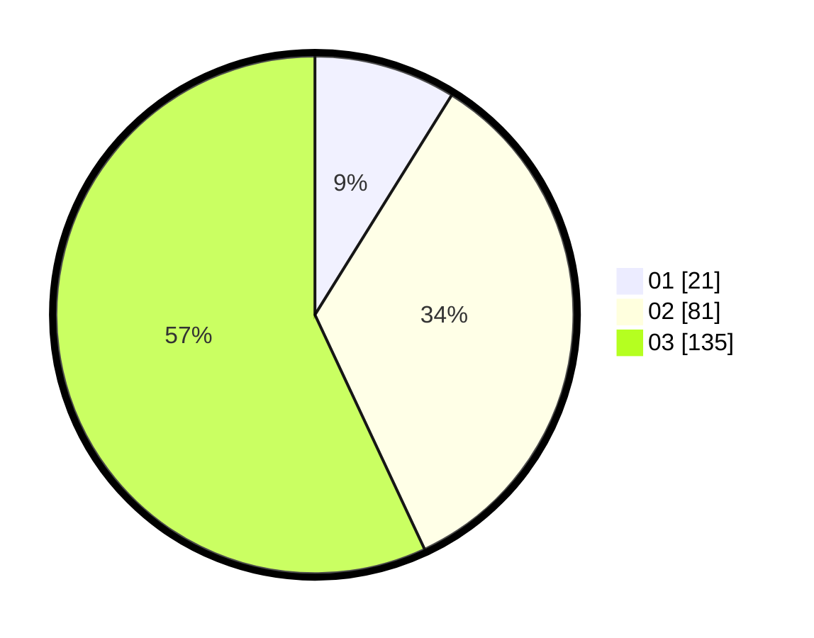

# Hasil

Hasil perolehan suara paslon dapat dilihat pada file paslon-01.txt, paslon-02.txt, dan paslon-03.txt.

Jika tidak ada, artinya data tersebut belum ada pada SIREKAP.

## Perolehan Suara

 * Paslon 01: **21**.
 * Paslon 02: **81**.
 * Paslon 03: **135**.

## Foto C Plano

https://sirekap-obj-formc.kpu.go.id/d2dd/pemilu/ppwp/31/73/08/10/05/3173081005117-20240214-231035--125a9f90-b2aa-4e2c-84b2-a68a7351db4e.jpg

https://sirekap-obj-formc.kpu.go.id/d2dd/pemilu/ppwp/31/73/08/10/05/3173081005117-20240214-181424--88a121fc-0467-4375-819c-a4c31adedb21.jpg

https://sirekap-obj-formc.kpu.go.id/d2dd/pemilu/ppwp/31/73/08/10/05/3173081005117-20240214-181738--57a506f4-f0fe-424a-a273-1cd345c86f28.jpg

## DATA PEMILIH TETAP

Jumlah pemilih dalam DPT: **289**.
 * L: **138**.
 * P: **151**.

## DATA PENGGUNA HAK PILIH

Jumlah pengguna hak pilih dalam DPT: **221**.
 * L: **104**.
 * P: **117**.

Jumlah pengguna hak pilih dalam DPTb: **11**.
 * L: **5**.
 * P: **6**.

Jumlah pengguna hak pilih dalam DPK: **8**.
 * L: **4**.
 * P: **4**.

Jumlah pengguna hak pilih: **240**.
 * L: **113**.
 * P: **127**.

## JUMLAH SUARA SAH DAN TIDAK SAH

JUMLAH SELURUH SUARA SAH: **237**.

JUMLAH SUARA TIDAK SAH: **3**.

JUMLAH SELURUH SUARA SAH DAN SUARA TIDAK SAH: **240**.
