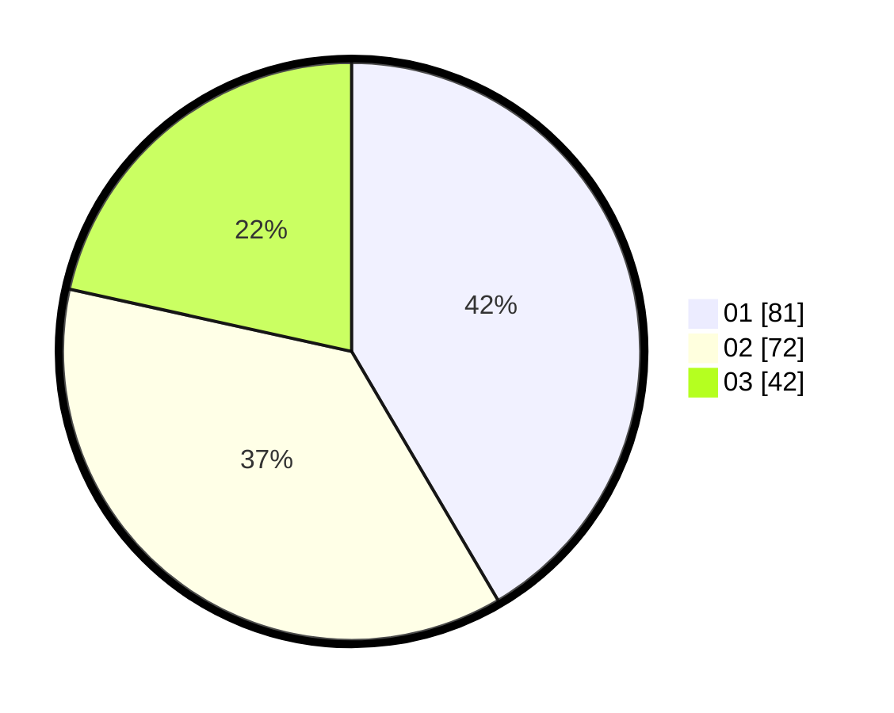

# Hasil

Hasil perolehan suara paslon dapat dilihat pada file paslon-01.txt, paslon-02.txt, dan paslon-03.txt.

Jika tidak ada, artinya data tersebut belum ada pada SIREKAP.

## Perolehan Suara

 * Paslon 01: **81**.
 * Paslon 02: **72**.
 * Paslon 03: **42**.

## Foto C Plano

https://sirekap-obj-formc.kpu.go.id/271a/pemilu/ppwp/31/73/08/10/05/3173081005122-20240214-212532--00b1976e-0c07-4c13-8fa4-51f3affd4166.jpg

https://sirekap-obj-formc.kpu.go.id/271a/pemilu/ppwp/31/73/08/10/05/3173081005122-20240214-212806--b7e498b1-34c0-4866-a6de-38373e15ba6e.jpg

https://sirekap-obj-formc.kpu.go.id/271a/pemilu/ppwp/31/73/08/10/05/3173081005122-20240214-212914--e0a19547-7333-4f64-9c57-e0dea0a3c969.jpg
