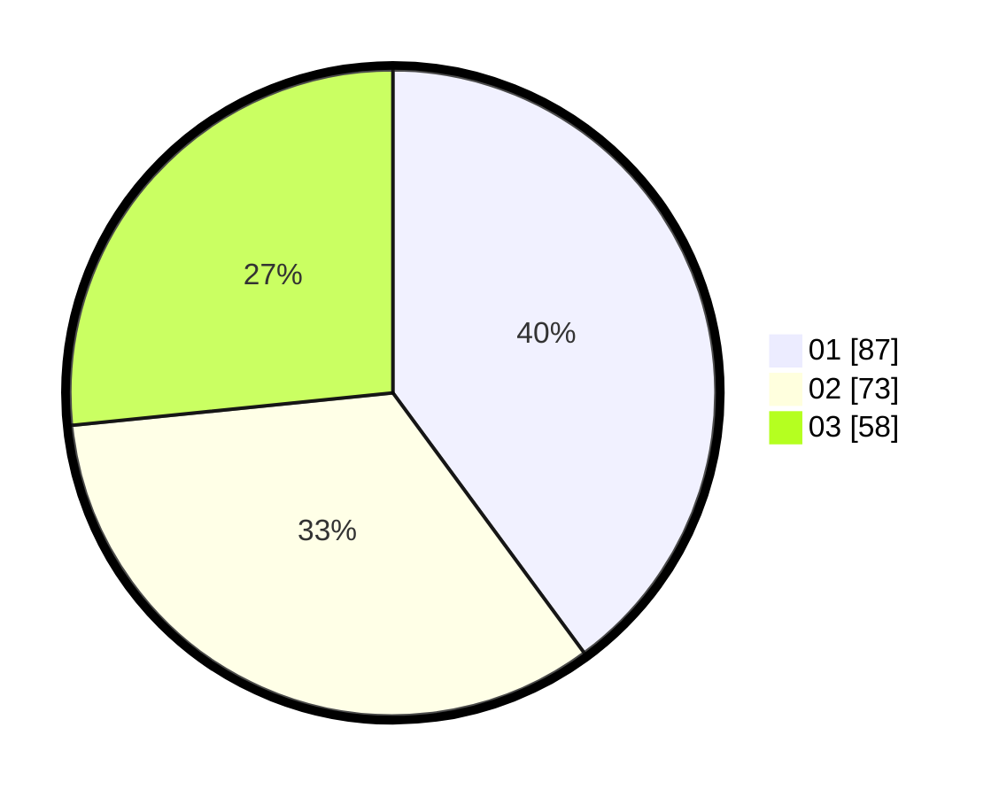

# Hasil

Hasil perolehan suara paslon dapat dilihat pada file paslon-01.txt, paslon-02.txt, dan paslon-03.txt.

Jika tidak ada, artinya data tersebut belum ada pada SIREKAP.

## Perolehan Suara

 * Paslon 01: **87**.
 * Paslon 02: **73**.
 * Paslon 03: **58**.

## Foto C Plano

https://sirekap-obj-formc.kpu.go.id/91c3/pemilu/ppwp/31/73/08/10/05/3173081005125-20240214-234119--5a863ec6-84fc-4254-b749-6be927b15a4a.jpg

https://sirekap-obj-formc.kpu.go.id/91c3/pemilu/ppwp/31/73/08/10/05/3173081005125-20240214-223310--542237d0-7851-41a3-a8ed-4059d9ded2ef.jpg

https://sirekap-obj-formc.kpu.go.id/91c3/pemilu/ppwp/31/73/08/10/05/3173081005125-20240214-230519--3a48f6f7-40c0-42ee-8d38-cd4f1c7091cc.jpg
