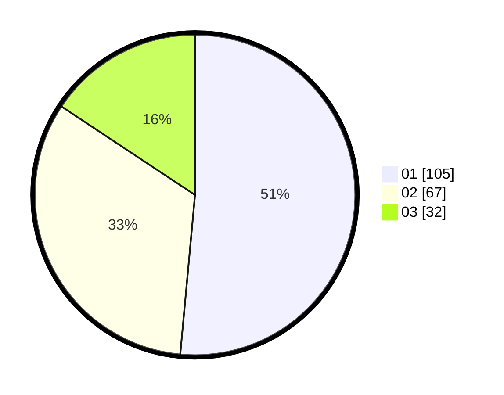

# Hasil

Hasil perolehan suara paslon dapat dilihat pada file paslon-01.txt, paslon-02.txt, dan paslon-03.txt.

Jika tidak ada, artinya data tersebut belum ada pada SIREKAP.

## Perolehan Suara

 * Paslon 01: **105**.
 * Paslon 02: **67**.
 * Paslon 03: **32**.

## Foto C Plano

https://sirekap-obj-formc.kpu.go.id/1535/pemilu/ppwp/31/73/08/10/05/3173081005129-20240214-212745--2a9d3251-170d-4403-9878-19b284a41839.jpg

https://sirekap-obj-formc.kpu.go.id/1535/pemilu/ppwp/31/73/08/10/05/3173081005129-20240214-213010--d5bf6ab0-0da4-4565-b9e2-f5d997495192.jpg

https://sirekap-obj-formc.kpu.go.id/1535/pemilu/ppwp/31/73/08/10/05/3173081005129-20240214-213225--3b996c2a-69a9-4497-8a95-06c806903443.jpg
