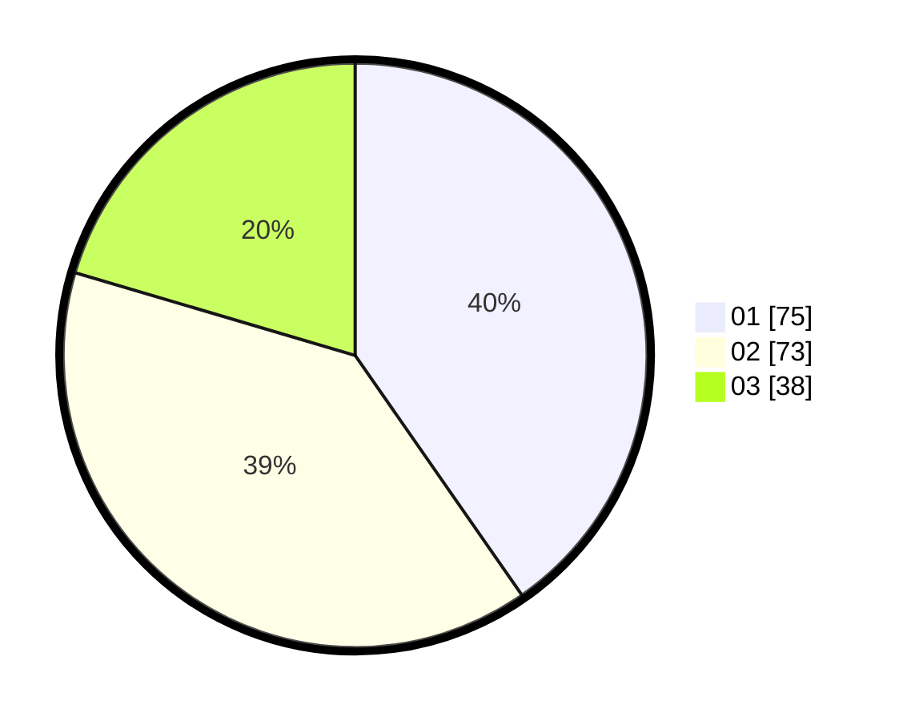

# Hasil

Hasil perolehan suara paslon dapat dilihat pada file paslon-01.txt, paslon-02.txt, dan paslon-03.txt.

Jika tidak ada, artinya data tersebut belum ada pada SIREKAP.

## Perolehan Suara

 * Paslon 01: **75**.
 * Paslon 02: **73**.
 * Paslon 03: **38**.

## Foto C Plano

https://sirekap-obj-formc.kpu.go.id/2087/pemilu/ppwp/31/73/08/10/05/3173081005130-20240214-204942--086b80b4-515b-4e3d-a34d-82e82701f92a.jpg

https://sirekap-obj-formc.kpu.go.id/2087/pemilu/ppwp/31/73/08/10/05/3173081005130-20240216-212346--fb2c22d4-dafa-4324-9fd3-717ed2efa3a7.jpg

https://sirekap-obj-formc.kpu.go.id/2087/pemilu/ppwp/31/73/08/10/05/3173081005130-20240214-210008--c45c91c4-1da7-4d26-9b15-a8c6cb2e4b2b.jpg
