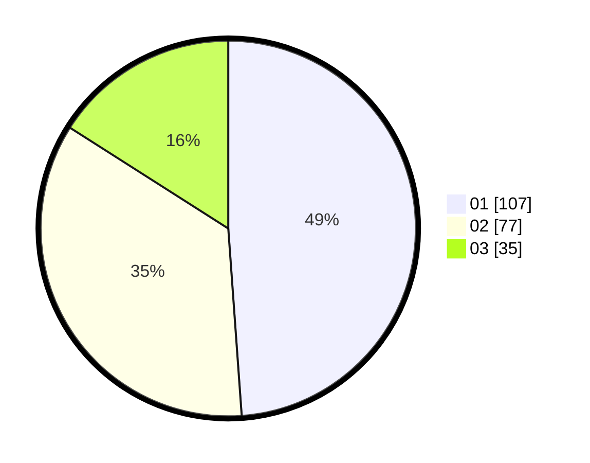

# Hasil

Hasil perolehan suara paslon dapat dilihat pada file paslon-01.txt, paslon-02.txt, dan paslon-03.txt.

Jika tidak ada, artinya data tersebut belum ada pada SIREKAP.

## Perolehan Suara

 * Paslon 01: **107**.
 * Paslon 02: **77**.
 * Paslon 03: **35**.

## Foto C Plano

https://sirekap-obj-formc.kpu.go.id/b3cb/pemilu/ppwp/31/73/08/10/05/3173081005132-20240214-184459--381df589-0596-47d9-bda2-4513101a9378.jpg

https://sirekap-obj-formc.kpu.go.id/b3cb/pemilu/ppwp/31/73/08/10/05/3173081005132-20240214-184504--d0238215-8bf8-441b-b581-52ea759481b2.jpg

https://sirekap-obj-formc.kpu.go.id/b3cb/pemilu/ppwp/31/73/08/10/05/3173081005132-20240215-014947--5450ddb5-4819-4861-9c47-b1d2827a7992.jpg

## DATA PEMILIH TETAP

Jumlah pemilih dalam DPT: **268**.
 * L: **134**.
 * P: **134**.

## DATA PENGGUNA HAK PILIH

Jumlah pengguna hak pilih dalam DPT: **213**.
 * L: **103**.
 * P: **110**.

Jumlah pengguna hak pilih dalam DPTb: **2**.
 * L: **1**.
 * P: **1**.

Jumlah pengguna hak pilih dalam DPK: **6**.
 * L: **4**.
 * P: **2**.

Jumlah pengguna hak pilih: **221**.
 * L: **108**.
 * P: **113**.

## JUMLAH SUARA SAH DAN TIDAK SAH

JUMLAH SELURUH SUARA SAH: **219**.

JUMLAH SUARA TIDAK SAH: **2**.

JUMLAH SELURUH SUARA SAH DAN SUARA TIDAK SAH: **221**.
