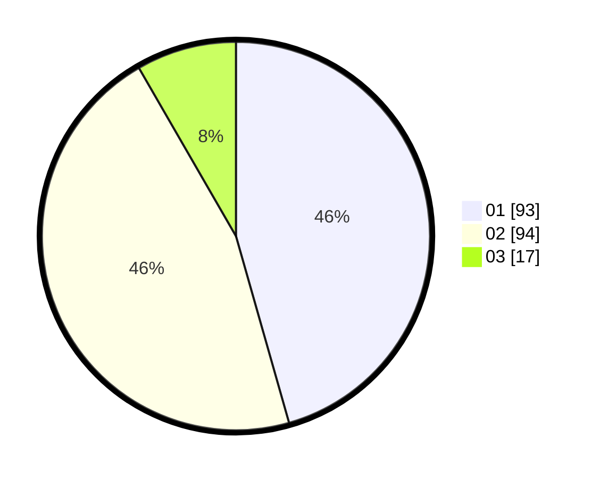

# Hasil

Hasil perolehan suara paslon dapat dilihat pada file paslon-01.txt, paslon-02.txt, dan paslon-03.txt.

Jika tidak ada, artinya data tersebut belum ada pada SIREKAP.

## Perolehan Suara

 * Paslon 01: **93**.
 * Paslon 02: **94**.
 * Paslon 03: **17**.

## Foto C Plano

https://sirekap-obj-formc.kpu.go.id/51e1/pemilu/ppwp/31/73/08/10/05/3173081005136-20240214-200100--e894b2de-190b-44eb-b4ba-0e95c380f102.jpg

https://sirekap-obj-formc.kpu.go.id/51e1/pemilu/ppwp/31/73/08/10/05/3173081005136-20240214-185847--4182b7fc-c924-4c0c-8d66-fab7dbabdb97.jpg

https://sirekap-obj-formc.kpu.go.id/51e1/pemilu/ppwp/31/73/08/10/05/3173081005136-20240214-185850--1f5c485f-4bbc-4b98-b97b-b42eaac93b28.jpg

## DATA PEMILIH TETAP

Jumlah pemilih dalam DPT: **277**.
 * L: **134**.
 * P: **143**.

## DATA PENGGUNA HAK PILIH

Jumlah pengguna hak pilih dalam DPT: **208**.
 * L: **93**.
 * P: **115**.

Jumlah pengguna hak pilih dalam DPTb: **1**.
 * L: **1**.
 * P: **0**.

Jumlah pengguna hak pilih dalam DPK: **0**.
 * L: **0**.
 * P: **0**.

Jumlah pengguna hak pilih: **209**.
 * L: **94**.
 * P: **115**.

## JUMLAH SUARA SAH DAN TIDAK SAH

JUMLAH SELURUH SUARA SAH: **204**.

JUMLAH SUARA TIDAK SAH: **5**.

JUMLAH SELURUH SUARA SAH DAN SUARA TIDAK SAH: **209**.
