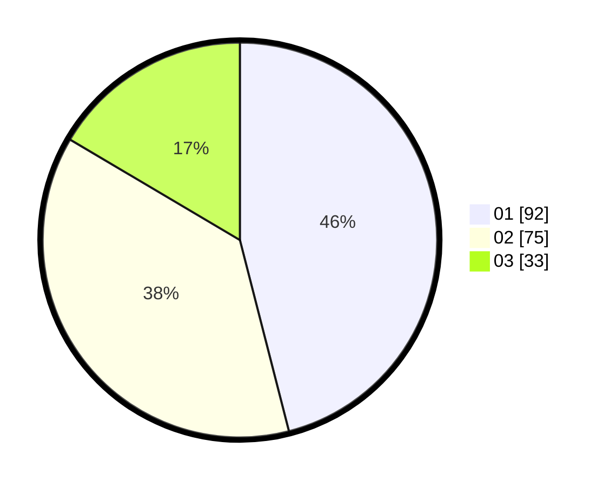

# Hasil

Hasil perolehan suara paslon dapat dilihat pada file paslon-01.txt, paslon-02.txt, dan paslon-03.txt.

Jika tidak ada, artinya data tersebut belum ada pada SIREKAP.

## Perolehan Suara

 * Paslon 01: **92**.
 * Paslon 02: **75**.
 * Paslon 03: **33**.

## Foto C Plano

https://sirekap-obj-formc.kpu.go.id/8661/pemilu/ppwp/31/73/08/10/05/3173081005139-20240218-204143--66d0cb62-f874-4c8c-96ba-d5973ab3baab.jpg

https://sirekap-obj-formc.kpu.go.id/8661/pemilu/ppwp/31/73/08/10/05/3173081005139-20240218-204144--890b37a4-5289-44c0-a4f1-f773320ac841.jpg

https://sirekap-obj-formc.kpu.go.id/8661/pemilu/ppwp/31/73/08/10/05/3173081005139-20240218-204143--5df5b9da-c387-4c36-ba74-38bbee4b53b5.jpg

## DATA PEMILIH TETAP

Jumlah pemilih dalam DPT: **0**.
 * L: **0**.
 * P: **0**.

## DATA PENGGUNA HAK PILIH

Jumlah pengguna hak pilih dalam DPT: **0**.
 * L: **0**.
 * P: **0**.

Jumlah pengguna hak pilih dalam DPTb: **0**.
 * L: **0**.
 * P: **0**.

Jumlah pengguna hak pilih dalam DPK: **0**.
 * L: **0**.
 * P: **0**.

Jumlah pengguna hak pilih: **0**.
 * L: **0**.
 * P: **0**.

## JUMLAH SUARA SAH DAN TIDAK SAH

JUMLAH SELURUH SUARA SAH: **200**.

JUMLAH SUARA TIDAK SAH: **0**.

JUMLAH SELURUH SUARA SAH DAN SUARA TIDAK SAH: **200**.
