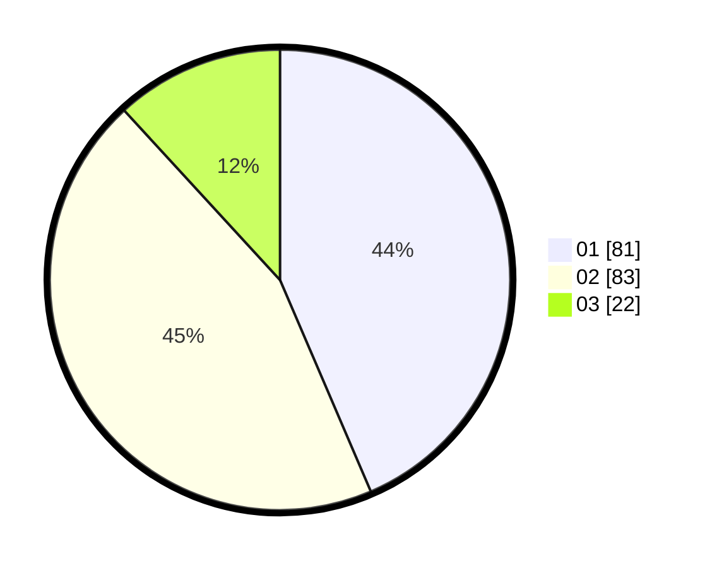

# Hasil

Hasil perolehan suara paslon dapat dilihat pada file paslon-01.txt, paslon-02.txt, dan paslon-03.txt.

Jika tidak ada, artinya data tersebut belum ada pada SIREKAP.

## Perolehan Suara

 * Paslon 01: **81**.
 * Paslon 02: **83**.
 * Paslon 03: **22**.

## Foto C Plano

https://sirekap-obj-formc.kpu.go.id/a98d/pemilu/ppwp/31/73/08/10/05/3173081005140-20240219-095221--30f8ad1b-38cc-423f-a101-1ebf09fd3029.jpg

https://sirekap-obj-formc.kpu.go.id/a98d/pemilu/ppwp/31/73/08/10/05/3173081005140-20240219-095223--8813e11d-952d-43f6-b786-49ed06d406d6.jpg

https://sirekap-obj-formc.kpu.go.id/a98d/pemilu/ppwp/31/73/08/10/05/3173081005140-20240219-095222--a1a0b03a-06cb-45f0-b64e-2ae1cf579c2f.jpg

## DATA PEMILIH TETAP

Jumlah pemilih dalam DPT: **246**.
 * L: **126**.
 * P: **120**.

## DATA PENGGUNA HAK PILIH

Jumlah pengguna hak pilih dalam DPT: **185**.
 * L: **92**.
 * P: **93**.

Jumlah pengguna hak pilih dalam DPTb: **2**.
 * L: **1**.
 * P: **1**.

Jumlah pengguna hak pilih dalam DPK: **1**.
 * L: **0**.
 * P: **1**.

Jumlah pengguna hak pilih: **188**.
 * L: **93**.
 * P: **95**.

## JUMLAH SUARA SAH DAN TIDAK SAH

JUMLAH SELURUH SUARA SAH: **186**.

JUMLAH SUARA TIDAK SAH: **2**.

JUMLAH SELURUH SUARA SAH DAN SUARA TIDAK SAH: **188**.
