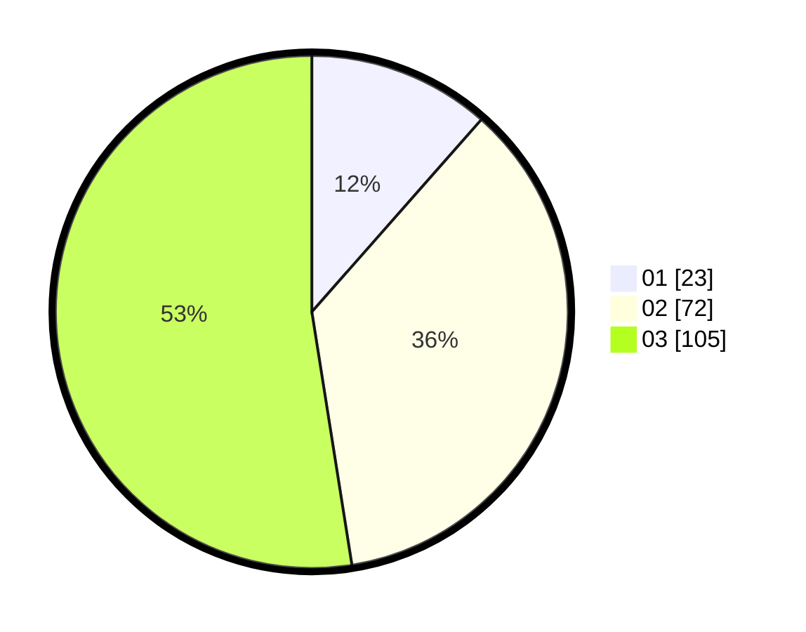

# Hasil

Hasil perolehan suara paslon dapat dilihat pada file paslon-01.txt, paslon-02.txt, dan paslon-03.txt.

Jika tidak ada, artinya data tersebut belum ada pada SIREKAP.

## Perolehan Suara

 * Paslon 01: **23**.
 * Paslon 02: **72**.
 * Paslon 03: **105**.

## Foto C Plano

https://sirekap-obj-formc.kpu.go.id/6860/pemilu/ppwp/31/73/08/10/05/3173081005141-20240215-235412--00f72f55-9b93-4828-ab83-b0768482a05a.jpg

https://sirekap-obj-formc.kpu.go.id/6860/pemilu/ppwp/31/73/08/10/05/3173081005141-20240215-235415--ea623c00-2598-4e51-9faa-4f4468c10149.jpg

https://sirekap-obj-formc.kpu.go.id/6860/pemilu/ppwp/31/73/08/10/05/3173081005141-20240215-235414--c3a0a5b6-ca92-40f6-8e7b-acf8ed694bc7.jpg

## DATA PEMILIH TETAP

Jumlah pemilih dalam DPT: **201**.
 * L: **104**.
 * P: **97**.

## DATA PENGGUNA HAK PILIH

Jumlah pengguna hak pilih dalam DPT: **178**.
 * L: **93**.
 * P: **85**.

Jumlah pengguna hak pilih dalam DPTb: **14**.
 * L: **8**.
 * P: **6**.

Jumlah pengguna hak pilih dalam DPK: **9**.
 * L: **3**.
 * P: **6**.

Jumlah pengguna hak pilih: **201**.
 * L: **104**.
 * P: **97**.

## JUMLAH SUARA SAH DAN TIDAK SAH

JUMLAH SELURUH SUARA SAH: **200**.

JUMLAH SUARA TIDAK SAH: **1**.

JUMLAH SELURUH SUARA SAH DAN SUARA TIDAK SAH: **201**.
