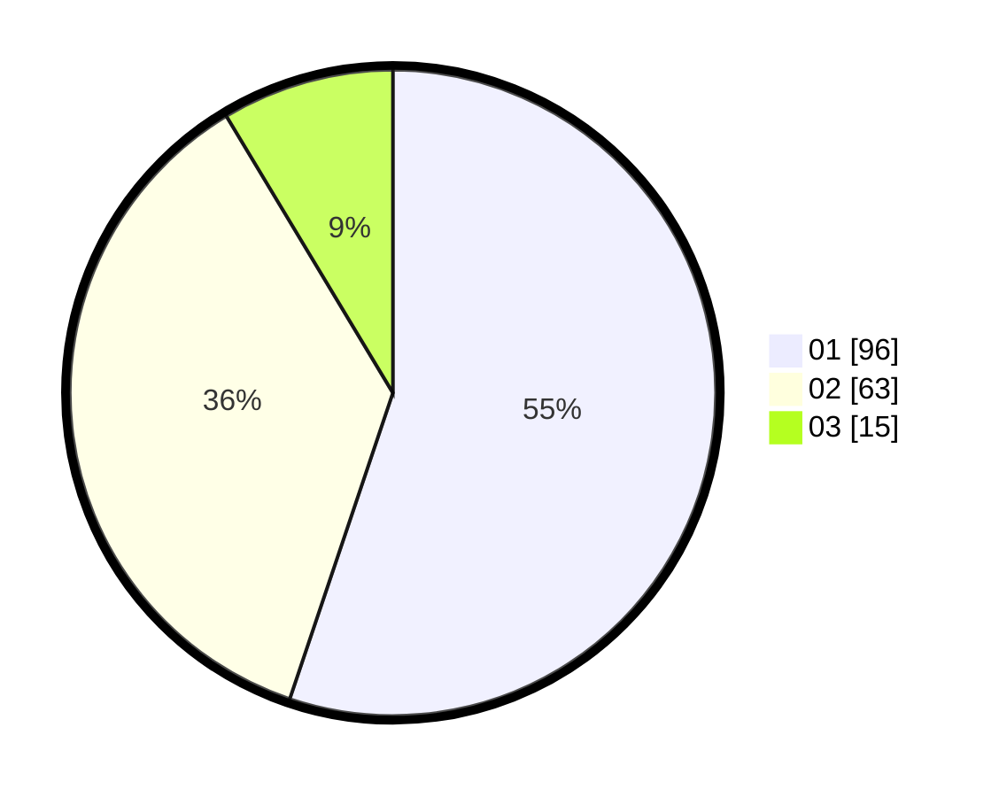

# Hasil

Hasil perolehan suara paslon dapat dilihat pada file paslon-01.txt, paslon-02.txt, dan paslon-03.txt.

Jika tidak ada, artinya data tersebut belum ada pada SIREKAP.

## Perolehan Suara

 * Paslon 01: **96**.
 * Paslon 02: **63**.
 * Paslon 03: **15**.

## Foto C Plano

https://sirekap-obj-formc.kpu.go.id/e5bc/pemilu/ppwp/31/73/08/10/06/3173081006001-20240216-153324--fa242a20-d531-42bb-912b-eccac644ce03.jpg

https://sirekap-obj-formc.kpu.go.id/e5bc/pemilu/ppwp/31/73/08/10/06/3173081006001-20240216-153325--a92a7206-0e1f-437b-9a17-cf5a3ee31b16.jpg

https://sirekap-obj-formc.kpu.go.id/e5bc/pemilu/ppwp/31/73/08/10/06/3173081006001-20240216-153325--9650a677-233c-4fe3-bd7a-8d95642cf44b.jpg

## DATA PEMILIH TETAP

Jumlah pemilih dalam DPT: **209**.
 * L: **108**.
 * P: **101**.

## DATA PENGGUNA HAK PILIH

Jumlah pengguna hak pilih dalam DPT: **169**.
 * L: **84**.
 * P: **85**.

Jumlah pengguna hak pilih dalam DPTb: **7**.
 * L: **2**.
 * P: **5**.

Jumlah pengguna hak pilih dalam DPK: **0**.
 * L: **0**.
 * P: **0**.

Jumlah pengguna hak pilih: **176**.
 * L: **86**.
 * P: **90**.

## JUMLAH SUARA SAH DAN TIDAK SAH

JUMLAH SELURUH SUARA SAH: **174**.

JUMLAH SUARA TIDAK SAH: **2**.

JUMLAH SELURUH SUARA SAH DAN SUARA TIDAK SAH: **176**.
