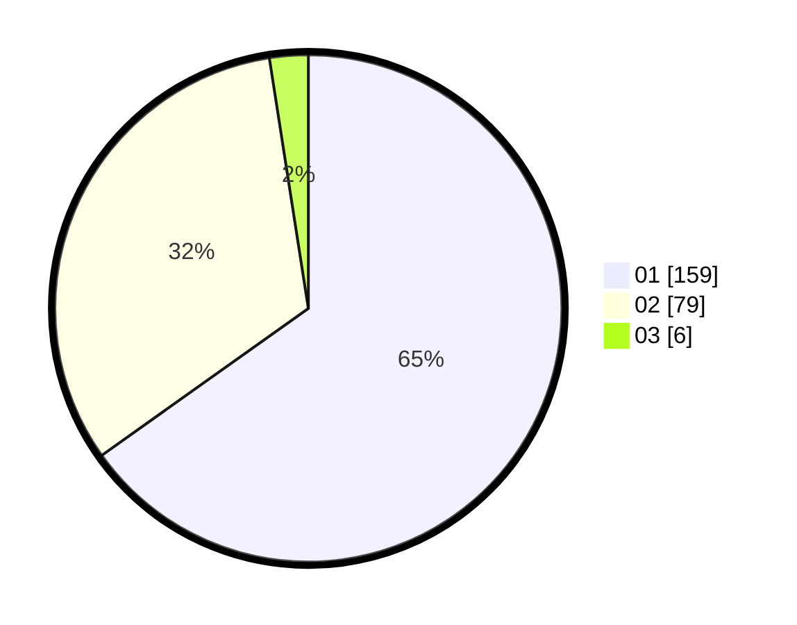

# Hasil

Hasil perolehan suara paslon dapat dilihat pada file paslon-01.txt, paslon-02.txt, dan paslon-03.txt.

Jika tidak ada, artinya data tersebut belum ada pada SIREKAP.

## Perolehan Suara

 * Paslon 01: **159**.
 * Paslon 02: **79**.
 * Paslon 03: **6**.

## Foto C Plano

https://sirekap-obj-formc.kpu.go.id/786b/pemilu/ppwp/31/73/08/10/06/3173081006008-20240216-180028--19fad2ed-f968-4936-b139-c7027bdecfd8.jpg

https://sirekap-obj-formc.kpu.go.id/786b/pemilu/ppwp/31/73/08/10/06/3173081006008-20240216-180030--459d8d32-0e92-4cf4-98cf-6a4e5c2da599.jpg

https://sirekap-obj-formc.kpu.go.id/786b/pemilu/ppwp/31/73/08/10/06/3173081006008-20240216-180029--f39e91fe-3042-4fa8-bfff-b05ecba9402b.jpg

## DATA PEMILIH TETAP

Jumlah pemilih dalam DPT: **297**.
 * L: **151**.
 * P: **146**.

## DATA PENGGUNA HAK PILIH

Jumlah pengguna hak pilih dalam DPT: **245**.
 * L: **121**.
 * P: **124**.

Jumlah pengguna hak pilih dalam DPTb: **1**.
 * L: **0**.
 * P: **1**.

Jumlah pengguna hak pilih dalam DPK: **1**.
 * L: **0**.
 * P: **1**.

Jumlah pengguna hak pilih: **247**.
 * L: **121**.
 * P: **126**.

## JUMLAH SUARA SAH DAN TIDAK SAH

JUMLAH SELURUH SUARA SAH: **244**.

JUMLAH SUARA TIDAK SAH: **3**.

JUMLAH SELURUH SUARA SAH DAN SUARA TIDAK SAH: **247**.
