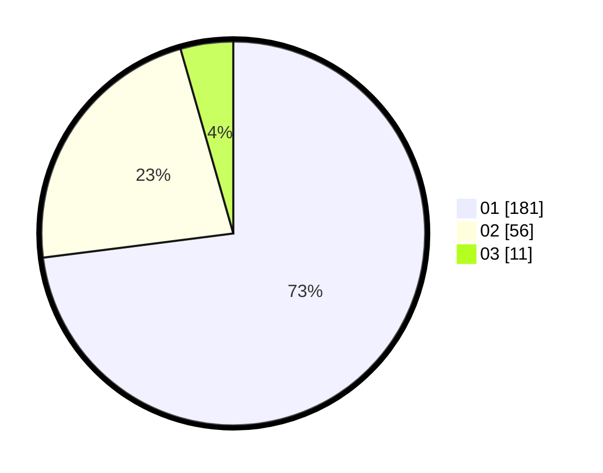

# Hasil

Hasil perolehan suara paslon dapat dilihat pada file paslon-01.txt, paslon-02.txt, dan paslon-03.txt.

Jika tidak ada, artinya data tersebut belum ada pada SIREKAP.

## Perolehan Suara

 * Paslon 01: **181**.
 * Paslon 02: **56**.
 * Paslon 03: **11**.

## Foto C Plano

https://sirekap-obj-formc.kpu.go.id/0f53/pemilu/ppwp/31/73/08/10/06/3173081006009-20240216-114418--f40ed947-7b00-4498-8e9f-ff1becef6503.jpg

https://sirekap-obj-formc.kpu.go.id/0f53/pemilu/ppwp/31/73/08/10/06/3173081006009-20240216-114419--65acad5f-f9dc-405c-840a-6e3d4390e1eb.jpg

https://sirekap-obj-formc.kpu.go.id/0f53/pemilu/ppwp/31/73/08/10/06/3173081006009-20240216-114418--abe83399-c348-416e-98cf-c81e427f07f5.jpg

## DATA PEMILIH TETAP

Jumlah pemilih dalam DPT: **295**.
 * L: **138**.
 * P: **157**.

## DATA PENGGUNA HAK PILIH

Jumlah pengguna hak pilih dalam DPT: **250**.
 * L: **115**.
 * P: **135**.

Jumlah pengguna hak pilih dalam DPTb: **1**.
 * L: **0**.
 * P: **1**.

Jumlah pengguna hak pilih dalam DPK: **0**.
 * L: **0**.
 * P: **0**.

Jumlah pengguna hak pilih: **251**.
 * L: **115**.
 * P: **136**.

## JUMLAH SUARA SAH DAN TIDAK SAH

JUMLAH SELURUH SUARA SAH: **248**.

JUMLAH SUARA TIDAK SAH: **3**.

JUMLAH SELURUH SUARA SAH DAN SUARA TIDAK SAH: **251**.
