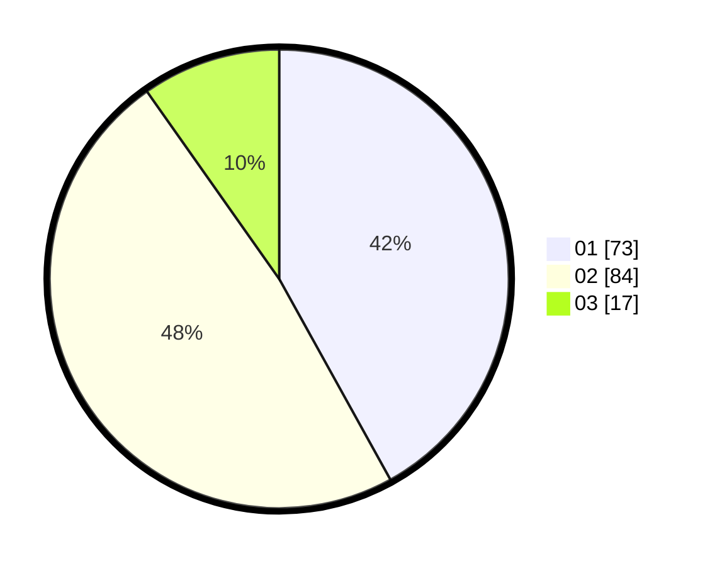

# Hasil

Hasil perolehan suara paslon dapat dilihat pada file paslon-01.txt, paslon-02.txt, dan paslon-03.txt.

Jika tidak ada, artinya data tersebut belum ada pada SIREKAP.

## Perolehan Suara

 * Paslon 01: **73**.
 * Paslon 02: **84**.
 * Paslon 03: **17**.

## Foto C Plano

https://sirekap-obj-formc.kpu.go.id/54dc/pemilu/ppwp/31/73/08/10/06/3173081006015-20240214-203435--ea3bf7c6-6756-4f4e-80d4-6ddfa2a981cb.jpg

https://sirekap-obj-formc.kpu.go.id/54dc/pemilu/ppwp/31/73/08/10/06/3173081006015-20240214-203543--f1245457-82be-48eb-93af-15e6fb79682e.jpg

https://sirekap-obj-formc.kpu.go.id/54dc/pemilu/ppwp/31/73/08/10/06/3173081006015-20240214-203746--1ed27fd4-6be7-439b-82a0-35dc37ed9b77.jpg
