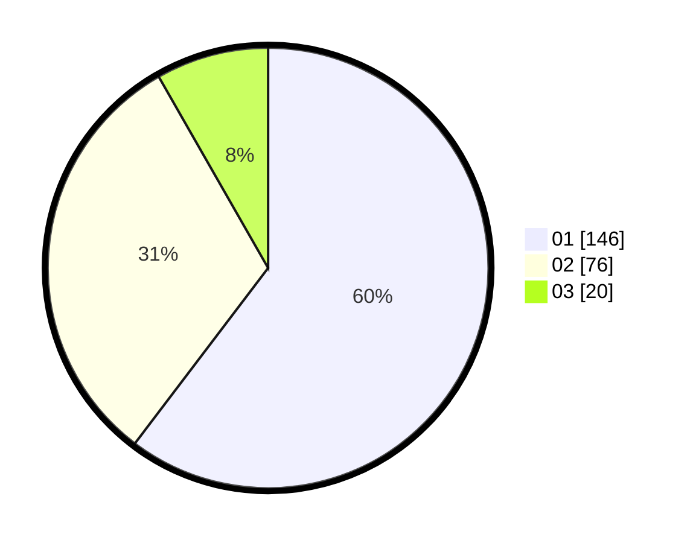

# Hasil

Hasil perolehan suara paslon dapat dilihat pada file paslon-01.txt, paslon-02.txt, dan paslon-03.txt.

Jika tidak ada, artinya data tersebut belum ada pada SIREKAP.

## Perolehan Suara

 * Paslon 01: **146**.
 * Paslon 02: **76**.
 * Paslon 03: **20**.

## Foto C Plano

https://sirekap-obj-formc.kpu.go.id/2b9b/pemilu/ppwp/31/73/08/10/06/3173081006021-20240214-215109--a877b570-8d42-48e4-b1be-40720351577e.jpg

https://sirekap-obj-formc.kpu.go.id/2b9b/pemilu/ppwp/31/73/08/10/06/3173081006021-20240214-215441--6e73897c-ba03-47b5-b5cd-fc5649c74bac.jpg

https://sirekap-obj-formc.kpu.go.id/2b9b/pemilu/ppwp/31/73/08/10/06/3173081006021-20240214-215548--536c5373-f1b5-4a46-9f4a-11cda7bed171.jpg
