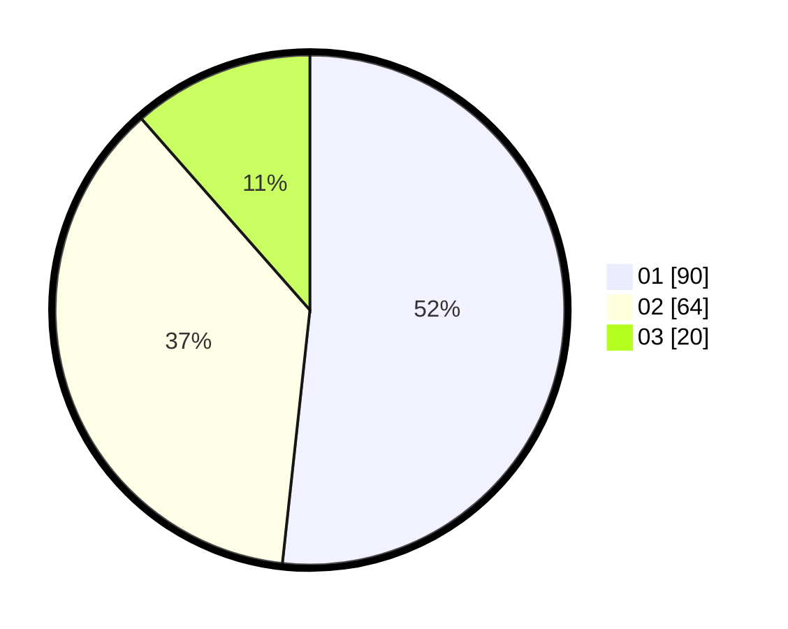

# Hasil

Hasil perolehan suara paslon dapat dilihat pada file paslon-01.txt, paslon-02.txt, dan paslon-03.txt.

Jika tidak ada, artinya data tersebut belum ada pada SIREKAP.

## Perolehan Suara

 * Paslon 01: **90**.
 * Paslon 02: **64**.
 * Paslon 03: **20**.

## Foto C Plano

https://sirekap-obj-formc.kpu.go.id/6162/pemilu/ppwp/31/73/08/10/06/3173081006025-20240214-190741--1d281c81-d5ee-487a-a034-d2977db898d2.jpg

https://sirekap-obj-formc.kpu.go.id/6162/pemilu/ppwp/31/73/08/10/06/3173081006025-20240214-235958--042ebeed-aebf-4f25-b950-b06d5a1651c7.jpg

https://sirekap-obj-formc.kpu.go.id/6162/pemilu/ppwp/31/73/08/10/06/3173081006025-20240214-230029--fd1a2601-0f2a-4d61-9b6b-686a7c39ff4b.jpg

## DATA PEMILIH TETAP

Jumlah pemilih dalam DPT: **205**.
 * L: **100**.
 * P: **105**.

## DATA PENGGUNA HAK PILIH

Jumlah pengguna hak pilih dalam DPT: **161**.
 * L: **76**.
 * P: **85**.

Jumlah pengguna hak pilih dalam DPTb: **11**.
 * L: **4**.
 * P: **7**.

Jumlah pengguna hak pilih dalam DPK: **3**.
 * L: **2**.
 * P: **1**.

Jumlah pengguna hak pilih: **175**.
 * L: **82**.
 * P: **93**.

## JUMLAH SUARA SAH DAN TIDAK SAH

JUMLAH SELURUH SUARA SAH: **0**.

JUMLAH SUARA TIDAK SAH: **0**.

JUMLAH SELURUH SUARA SAH DAN SUARA TIDAK SAH: **0**.
