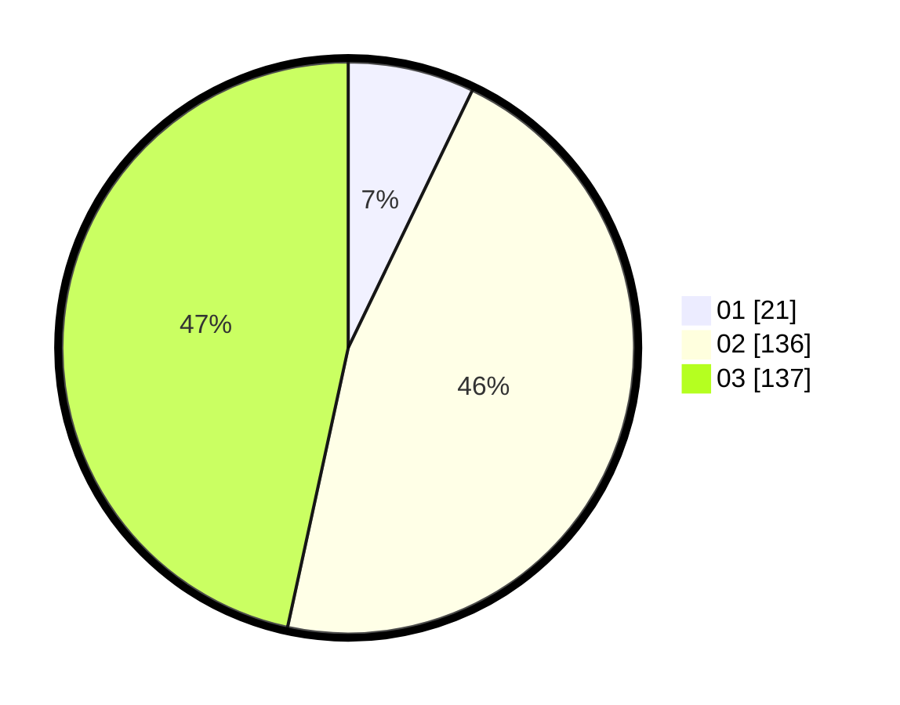

# Hasil

Hasil perolehan suara paslon dapat dilihat pada file paslon-01.txt, paslon-02.txt, dan paslon-03.txt.

Jika tidak ada, artinya data tersebut belum ada pada SIREKAP.

## Perolehan Suara

 * Paslon 01: **21**.
 * Paslon 02: **136**.
 * Paslon 03: **137**.

## Foto C Plano

https://sirekap-obj-formc.kpu.go.id/b50d/pemilu/ppwp/31/73/08/10/06/3173081006027-20240214-234420--f27f653d-41b3-49af-9b96-347c173e7032.jpg

https://sirekap-obj-formc.kpu.go.id/b50d/pemilu/ppwp/31/73/08/10/06/3173081006027-20240214-234502--b1306e5a-7e94-4f42-acc9-b004c27918ab.jpg

https://sirekap-obj-formc.kpu.go.id/b50d/pemilu/ppwp/31/73/08/10/06/3173081006027-20240214-234619--835a926c-04d7-4758-ae3e-d98f2e68751c.jpg
