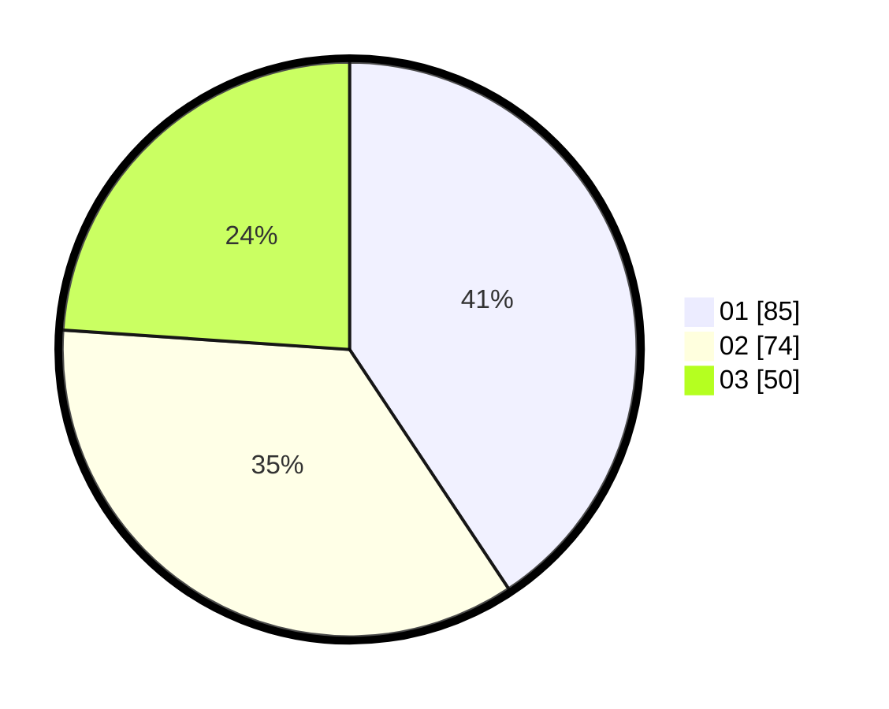

# Hasil

Hasil perolehan suara paslon dapat dilihat pada file paslon-01.txt, paslon-02.txt, dan paslon-03.txt.

Jika tidak ada, artinya data tersebut belum ada pada SIREKAP.

## Perolehan Suara

 * Paslon 01: **85**.
 * Paslon 02: **74**.
 * Paslon 03: **50**.

## Foto C Plano

https://sirekap-obj-formc.kpu.go.id/c53a/pemilu/ppwp/31/73/08/10/06/3173081006033-20240214-224409--85111b3d-f52b-4a8b-b945-3c6f28deebb7.jpg

https://sirekap-obj-formc.kpu.go.id/c53a/pemilu/ppwp/31/73/08/10/06/3173081006033-20240214-224739--f7668b45-b4c9-43e0-9c8a-d08948a68877.jpg

https://sirekap-obj-formc.kpu.go.id/c53a/pemilu/ppwp/31/73/08/10/06/3173081006033-20240214-224824--59404249-c369-45e6-abd3-a168751276d0.jpg
