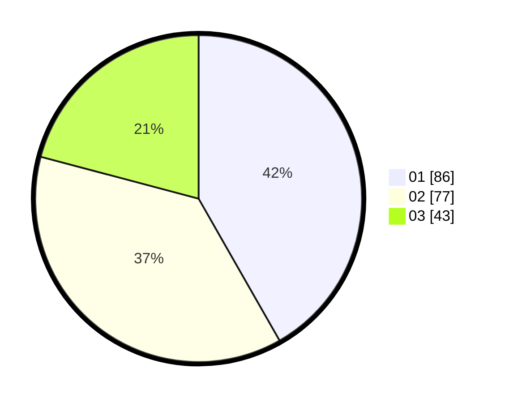

# Hasil

Hasil perolehan suara paslon dapat dilihat pada file paslon-01.txt, paslon-02.txt, dan paslon-03.txt.

Jika tidak ada, artinya data tersebut belum ada pada SIREKAP.

## Perolehan Suara

 * Paslon 01: **86**.
 * Paslon 02: **77**.
 * Paslon 03: **43**.

## Foto C Plano

https://sirekap-obj-formc.kpu.go.id/48d5/pemilu/ppwp/31/73/08/10/06/3173081006037-20240214-203720--5ea0a1ed-512d-436c-9859-2e2fad3422a7.jpg

https://sirekap-obj-formc.kpu.go.id/48d5/pemilu/ppwp/31/73/08/10/06/3173081006037-20240214-203813--34d19638-2bfb-4882-bddc-04a95595989f.jpg

https://sirekap-obj-formc.kpu.go.id/48d5/pemilu/ppwp/31/73/08/10/06/3173081006037-20240214-203820--59446c37-4b93-4df1-b880-0da468f7122c.jpg

## DATA PEMILIH TETAP

Jumlah pemilih dalam DPT: **247**.
 * L: **131**.
 * P: **116**.

## DATA PENGGUNA HAK PILIH

Jumlah pengguna hak pilih dalam DPT: **193**.
 * L: **96**.
 * P: **97**.

Jumlah pengguna hak pilih dalam DPTb: **13**.
 * L: **6**.
 * P: **7**.

Jumlah pengguna hak pilih dalam DPK: **0**.
 * L: **0**.
 * P: **0**.

Jumlah pengguna hak pilih: **206**.
 * L: **102**.
 * P: **104**.

## JUMLAH SUARA SAH DAN TIDAK SAH

JUMLAH SELURUH SUARA SAH: **206**.

JUMLAH SUARA TIDAK SAH: **0**.

JUMLAH SELURUH SUARA SAH DAN SUARA TIDAK SAH: **206**.
