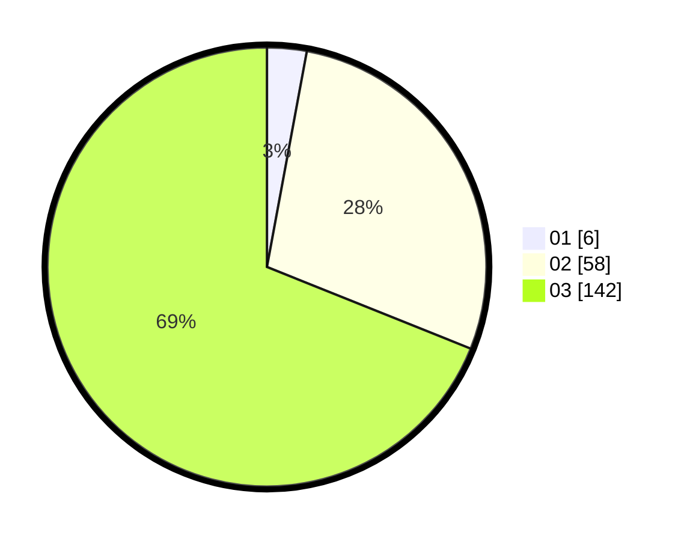

# Hasil

Hasil perolehan suara paslon dapat dilihat pada file paslon-01.txt, paslon-02.txt, dan paslon-03.txt.

Jika tidak ada, artinya data tersebut belum ada pada SIREKAP.

## Perolehan Suara

 * Paslon 01: **6**.
 * Paslon 02: **58**.
 * Paslon 03: **142**.

## Foto C Plano

https://sirekap-obj-formc.kpu.go.id/5483/pemilu/ppwp/31/73/08/10/06/3173081006038-20240215-062652--38134fc7-72bf-4ca6-bb34-642b31f4b2e0.jpg

https://sirekap-obj-formc.kpu.go.id/5483/pemilu/ppwp/31/73/08/10/06/3173081006038-20240215-062713--fae420a0-3408-4775-9e1c-628e9309a412.jpg

https://sirekap-obj-formc.kpu.go.id/5483/pemilu/ppwp/31/73/08/10/06/3173081006038-20240215-062702--6cff67ae-146d-4d93-9134-34eb49efd596.jpg

## DATA PEMILIH TETAP

Jumlah pemilih dalam DPT: **257**.
 * L: **126**.
 * P: **131**.

## DATA PENGGUNA HAK PILIH

Jumlah pengguna hak pilih dalam DPT: **183**.
 * L: **90**.
 * P: **93**.

Jumlah pengguna hak pilih dalam DPTb: **15**.
 * L: **4**.
 * P: **11**.

Jumlah pengguna hak pilih dalam DPK: **10**.
 * L: **5**.
 * P: **5**.

Jumlah pengguna hak pilih: **208**.
 * L: **99**.
 * P: **109**.

## JUMLAH SUARA SAH DAN TIDAK SAH

JUMLAH SELURUH SUARA SAH: **206**.

JUMLAH SUARA TIDAK SAH: **2**.

JUMLAH SELURUH SUARA SAH DAN SUARA TIDAK SAH: **208**.
