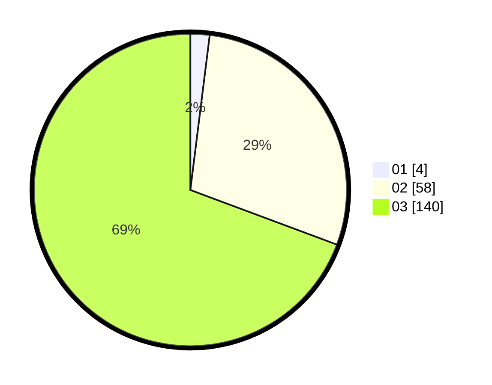

# Hasil

Hasil perolehan suara paslon dapat dilihat pada file paslon-01.txt, paslon-02.txt, dan paslon-03.txt.

Jika tidak ada, artinya data tersebut belum ada pada SIREKAP.

## Perolehan Suara

 * Paslon 01: **4**.
 * Paslon 02: **58**.
 * Paslon 03: **140**.

## Foto C Plano

https://sirekap-obj-formc.kpu.go.id/7ca4/pemilu/ppwp/31/73/08/10/06/3173081006039-20240215-210239--6805d4fd-4d68-45cd-8af0-35b2a85ee8a1.jpg

https://sirekap-obj-formc.kpu.go.id/7ca4/pemilu/ppwp/31/73/08/10/06/3173081006039-20240215-210243--21d3a130-1035-4989-b2b7-7942bb56162f.jpg

https://sirekap-obj-formc.kpu.go.id/7ca4/pemilu/ppwp/31/73/08/10/06/3173081006039-20240215-210242--e9add127-f50e-446e-869b-e3ab7ea3a2a8.jpg

## DATA PEMILIH TETAP

Jumlah pemilih dalam DPT: **226**.
 * L: **102**.
 * P: **124**.

## DATA PENGGUNA HAK PILIH

Jumlah pengguna hak pilih dalam DPT: **176**.
 * L: **84**.
 * P: **92**.

Jumlah pengguna hak pilih dalam DPTb: **19**.
 * L: **5**.
 * P: **14**.

Jumlah pengguna hak pilih dalam DPK: **9**.
 * L: **5**.
 * P: **4**.

Jumlah pengguna hak pilih: **204**.
 * L: **94**.
 * P: **110**.

## JUMLAH SUARA SAH DAN TIDAK SAH

JUMLAH SELURUH SUARA SAH: **202**.

JUMLAH SUARA TIDAK SAH: **2**.

JUMLAH SELURUH SUARA SAH DAN SUARA TIDAK SAH: **204**.
