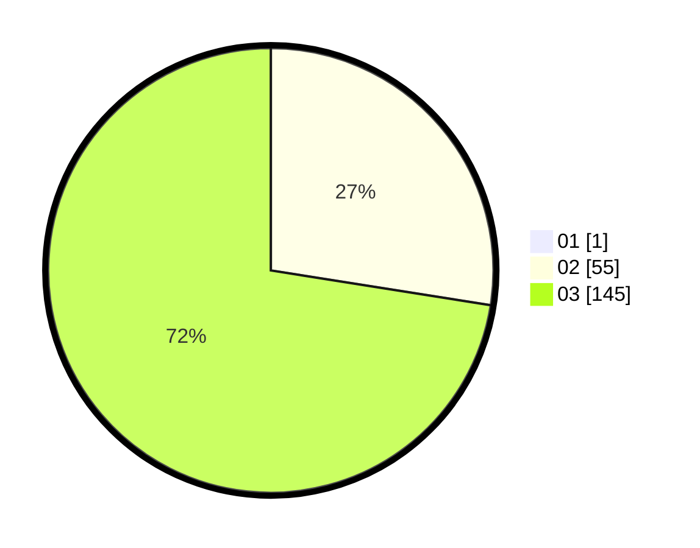

# Hasil

Hasil perolehan suara paslon dapat dilihat pada file paslon-01.txt, paslon-02.txt, dan paslon-03.txt.

Jika tidak ada, artinya data tersebut belum ada pada SIREKAP.

## Perolehan Suara

 * Paslon 01: **1**.
 * Paslon 02: **55**.
 * Paslon 03: **145**.

## Foto C Plano

https://sirekap-obj-formc.kpu.go.id/86d7/pemilu/ppwp/31/73/08/10/06/3173081006040-20240215-234755--582e5ff5-b413-472a-bd91-d273a8ce5299.jpg

https://sirekap-obj-formc.kpu.go.id/86d7/pemilu/ppwp/31/73/08/10/06/3173081006040-20240215-234802--b088f276-587b-4518-871d-a91add55c063.jpg

https://sirekap-obj-formc.kpu.go.id/86d7/pemilu/ppwp/31/73/08/10/06/3173081006040-20240215-234800--6ab47af2-d003-4e0c-98e1-b141a2ade770.jpg

## DATA PEMILIH TETAP

Jumlah pemilih dalam DPT: **219**.
 * L: **110**.
 * P: **109**.

## DATA PENGGUNA HAK PILIH

Jumlah pengguna hak pilih dalam DPT: **171**.
 * L: **85**.
 * P: **86**.

Jumlah pengguna hak pilih dalam DPTb: **17**.
 * L: **5**.
 * P: **12**.

Jumlah pengguna hak pilih dalam DPK: **14**.
 * L: **6**.
 * P: **8**.

Jumlah pengguna hak pilih: **202**.
 * L: **96**.
 * P: **106**.

## JUMLAH SUARA SAH DAN TIDAK SAH

JUMLAH SELURUH SUARA SAH: **201**.

JUMLAH SUARA TIDAK SAH: **1**.

JUMLAH SELURUH SUARA SAH DAN SUARA TIDAK SAH: **202**.
