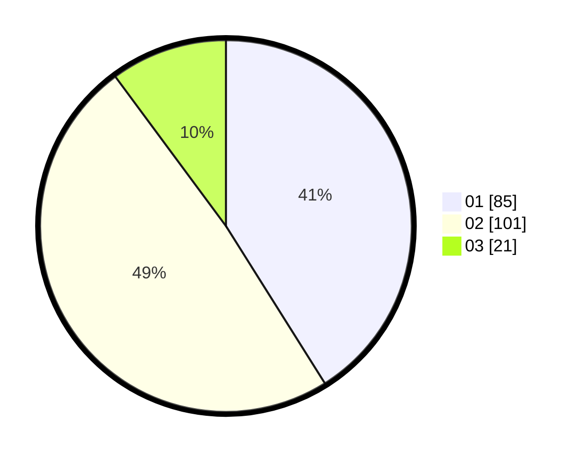

# Hasil

Hasil perolehan suara paslon dapat dilihat pada file paslon-01.txt, paslon-02.txt, dan paslon-03.txt.

Jika tidak ada, artinya data tersebut belum ada pada SIREKAP.

## Perolehan Suara

 * Paslon 01: **85**.
 * Paslon 02: **101**.
 * Paslon 03: **21**.

## Foto C Plano

https://sirekap-obj-formc.kpu.go.id/6b5b/pemilu/ppwp/31/73/08/10/06/3173081006041-20240214-205500--89fada5d-20da-4018-a9e2-3e25e889d3ed.jpg

https://sirekap-obj-formc.kpu.go.id/6b5b/pemilu/ppwp/31/73/08/10/06/3173081006041-20240214-204802--48772ac1-66f4-44c1-8e25-933f389e5df6.jpg

https://sirekap-obj-formc.kpu.go.id/6b5b/pemilu/ppwp/31/73/08/10/06/3173081006041-20240214-205217--cd5a0aff-9ddd-4ddd-8c99-984ee2359fb2.jpg
