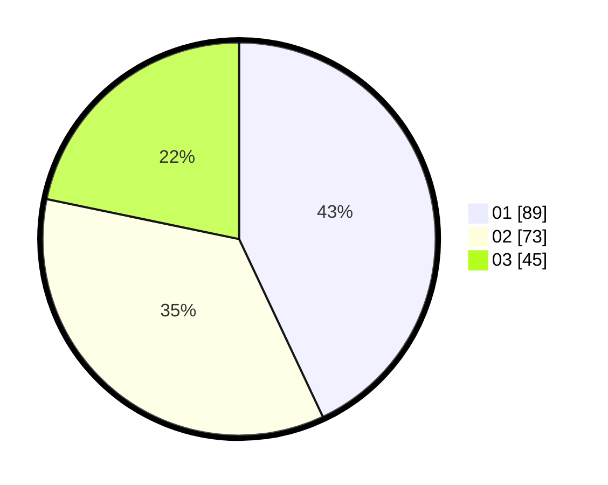

# Hasil

Hasil perolehan suara paslon dapat dilihat pada file paslon-01.txt, paslon-02.txt, dan paslon-03.txt.

Jika tidak ada, artinya data tersebut belum ada pada SIREKAP.

## Perolehan Suara

 * Paslon 01: **89**.
 * Paslon 02: **73**.
 * Paslon 03: **45**.

## Foto C Plano

https://sirekap-obj-formc.kpu.go.id/9fcb/pemilu/ppwp/31/73/08/10/06/3173081006047-20240214-155427--0f14c7ee-228e-4a8b-b83e-39441f95ba13.jpg

https://sirekap-obj-formc.kpu.go.id/9fcb/pemilu/ppwp/31/73/08/10/06/3173081006047-20240214-155751--582d0e02-5a1c-4e4d-86a3-28a97b4cb079.jpg

https://sirekap-obj-formc.kpu.go.id/9fcb/pemilu/ppwp/31/73/08/10/06/3173081006047-20240214-155549--8acbe7e4-1996-4a18-b9c6-5243de391ba0.jpg

## DATA PEMILIH TETAP

Jumlah pemilih dalam DPT: **250**.
 * L: **125**.
 * P: **125**.

## DATA PENGGUNA HAK PILIH

Jumlah pengguna hak pilih dalam DPT: **208**.
 * L: **98**.
 * P: **110**.

Jumlah pengguna hak pilih dalam DPTb: **1**.
 * L: **0**.
 * P: **1**.

Jumlah pengguna hak pilih dalam DPK: **0**.
 * L: **0**.
 * P: **0**.

Jumlah pengguna hak pilih: **209**.
 * L: **98**.
 * P: **111**.

## JUMLAH SUARA SAH DAN TIDAK SAH

JUMLAH SELURUH SUARA SAH: **207**.

JUMLAH SUARA TIDAK SAH: **2**.

JUMLAH SELURUH SUARA SAH DAN SUARA TIDAK SAH: **209**.
