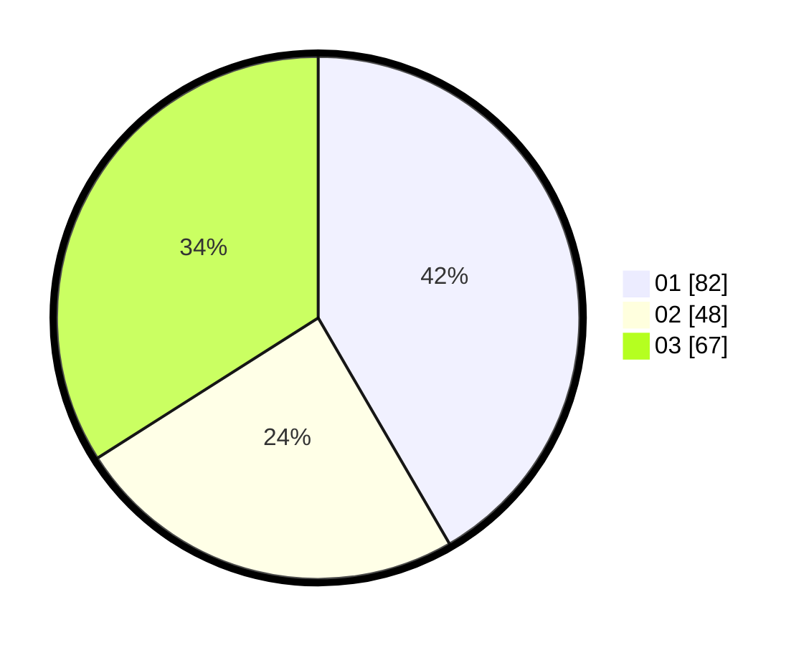

# Hasil

Hasil perolehan suara paslon dapat dilihat pada file paslon-01.txt, paslon-02.txt, dan paslon-03.txt.

Jika tidak ada, artinya data tersebut belum ada pada SIREKAP.

## Perolehan Suara

 * Paslon 01: **82**.
 * Paslon 02: **48**.
 * Paslon 03: **67**.

## Foto C Plano

https://sirekap-obj-formc.kpu.go.id/4f1b/pemilu/ppwp/31/73/08/10/06/3173081006049-20240215-100359--e383df9f-9246-4e6e-a74d-cb80d19cb82b.jpg

https://sirekap-obj-formc.kpu.go.id/4f1b/pemilu/ppwp/31/73/08/10/06/3173081006049-20240215-100353--ca4f678e-2223-4bdc-a6ab-be35688e9508.jpg
