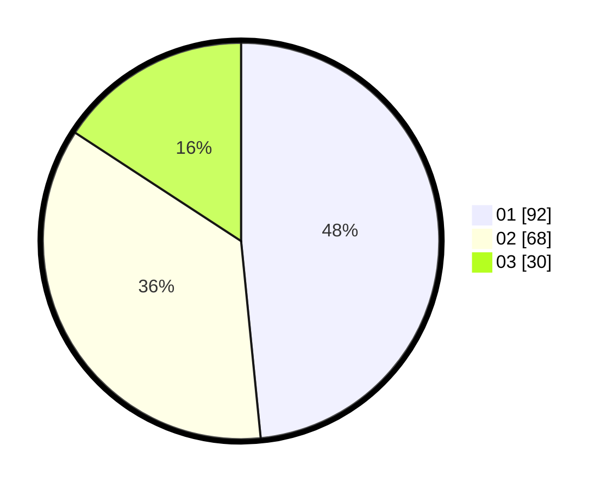

# Hasil

Hasil perolehan suara paslon dapat dilihat pada file paslon-01.txt, paslon-02.txt, dan paslon-03.txt.

Jika tidak ada, artinya data tersebut belum ada pada SIREKAP.

## Perolehan Suara

 * Paslon 01: **92**.
 * Paslon 02: **68**.
 * Paslon 03: **30**.

## Foto C Plano

https://sirekap-obj-formc.kpu.go.id/2bde/pemilu/ppwp/31/73/08/10/06/3173081006050-20240214-155507--01fa96c2-8caa-4077-8768-db54eb935bdc.jpg

https://sirekap-obj-formc.kpu.go.id/2bde/pemilu/ppwp/31/73/08/10/06/3173081006050-20240214-195943--f730b8b4-0701-49f4-881b-6b90e9ba584c.jpg

https://sirekap-obj-formc.kpu.go.id/2bde/pemilu/ppwp/31/73/08/10/06/3173081006050-20240214-155844--8425b01d-f2b2-48ad-999a-aa7ecc276f32.jpg

## DATA PEMILIH TETAP

Jumlah pemilih dalam DPT: **195**.
 * L: **91**.
 * P: **104**.

## DATA PENGGUNA HAK PILIH

Jumlah pengguna hak pilih dalam DPT: **195**.
 * L: **90**.
 * P: **104**.

Jumlah pengguna hak pilih dalam DPTb: **1**.
 * L: **1**.
 * P: **0**.

Jumlah pengguna hak pilih dalam DPK: **0**.
 * L: **0**.
 * P: **0**.

Jumlah pengguna hak pilih: **195**.
 * L: **91**.
 * P: **104**.

## JUMLAH SUARA SAH DAN TIDAK SAH

JUMLAH SELURUH SUARA SAH: **190**.

JUMLAH SUARA TIDAK SAH: **5**.

JUMLAH SELURUH SUARA SAH DAN SUARA TIDAK SAH: **195**.
