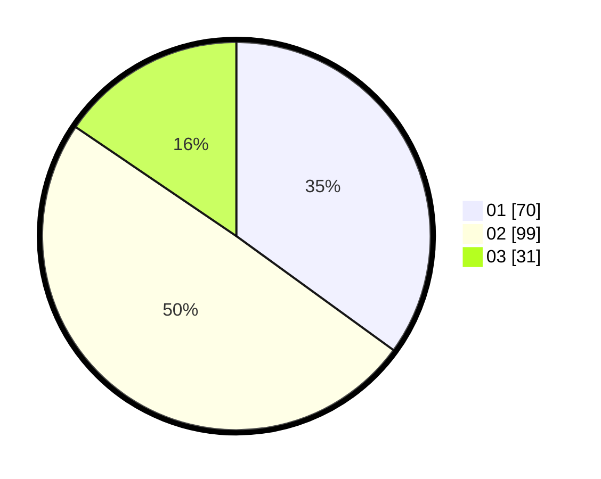

# Hasil

Hasil perolehan suara paslon dapat dilihat pada file paslon-01.txt, paslon-02.txt, dan paslon-03.txt.

Jika tidak ada, artinya data tersebut belum ada pada SIREKAP.

## Perolehan Suara

 * Paslon 01: **70**.
 * Paslon 02: **99**.
 * Paslon 03: **31**.

## Foto C Plano

https://sirekap-obj-formc.kpu.go.id/823b/pemilu/ppwp/31/73/08/10/06/3173081006051-20240218-211315--b438f485-4d88-41b5-89f8-974ad456f094.jpg

https://sirekap-obj-formc.kpu.go.id/823b/pemilu/ppwp/31/73/08/10/06/3173081006051-20240218-212336--073c2e35-19f4-447b-a0b0-d5d876e7d5c1.jpg

https://sirekap-obj-formc.kpu.go.id/823b/pemilu/ppwp/31/73/08/10/06/3173081006051-20240218-213940--37fd59f0-0fec-4c0e-b2f3-2567f3a9586f.jpg

## DATA PEMILIH TETAP

Jumlah pemilih dalam DPT: **275**.
 * L: **138**.
 * P: **137**.

## DATA PENGGUNA HAK PILIH

Jumlah pengguna hak pilih dalam DPT: **201**.
 * L: **97**.
 * P: **104**.

Jumlah pengguna hak pilih dalam DPTb: **0**.
 * L: **0**.
 * P: **0**.

Jumlah pengguna hak pilih dalam DPK: **0**.
 * L: **0**.
 * P: **0**.

Jumlah pengguna hak pilih: **201**.
 * L: **97**.
 * P: **104**.

## JUMLAH SUARA SAH DAN TIDAK SAH

JUMLAH SELURUH SUARA SAH: **194**.

JUMLAH SUARA TIDAK SAH: **7**.

JUMLAH SELURUH SUARA SAH DAN SUARA TIDAK SAH: **201**.
