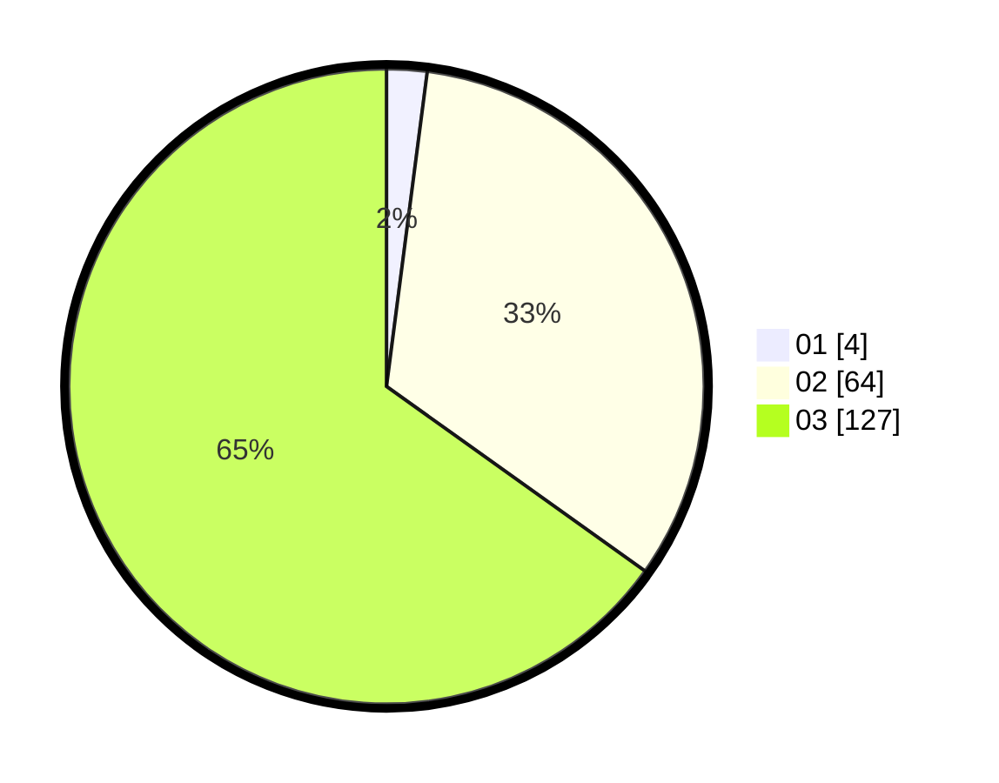

# Hasil

Hasil perolehan suara paslon dapat dilihat pada file paslon-01.txt, paslon-02.txt, dan paslon-03.txt.

Jika tidak ada, artinya data tersebut belum ada pada SIREKAP.

## Perolehan Suara

 * Paslon 01: **4**.
 * Paslon 02: **64**.
 * Paslon 03: **127**.

## Foto C Plano

https://sirekap-obj-formc.kpu.go.id/b8db/pemilu/ppwp/31/73/08/10/06/3173081006056-20240214-203041--f78579e1-435e-4851-bb62-274876995078.jpg

https://sirekap-obj-formc.kpu.go.id/b8db/pemilu/ppwp/31/73/08/10/06/3173081006056-20240214-203116--1efdcfa8-f353-4cbe-a4fc-9b2cc237fa0f.jpg

https://sirekap-obj-formc.kpu.go.id/b8db/pemilu/ppwp/31/73/08/10/06/3173081006056-20240214-203136--e175a8f9-20cd-4815-89ee-580259cc79a3.jpg
