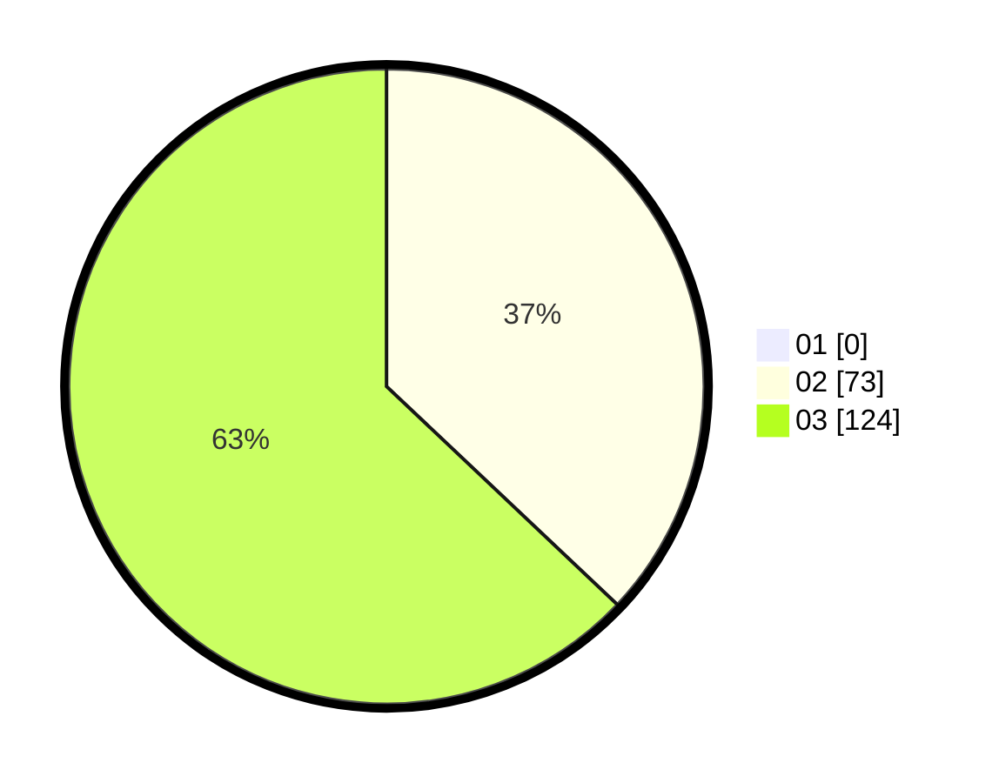

# Hasil

Hasil perolehan suara paslon dapat dilihat pada file paslon-01.txt, paslon-02.txt, dan paslon-03.txt.

Jika tidak ada, artinya data tersebut belum ada pada SIREKAP.

## Perolehan Suara

 * Paslon 01: **0**.
 * Paslon 02: **73**.
 * Paslon 03: **124**.

## Foto C Plano

https://sirekap-obj-formc.kpu.go.id/9d87/pemilu/ppwp/31/73/08/10/06/3173081006057-20240214-211041--9b9a5fae-e377-44a3-88e3-7d0c0afe3012.jpg

https://sirekap-obj-formc.kpu.go.id/9d87/pemilu/ppwp/31/73/08/10/06/3173081006057-20240214-211242--5ca965c8-d749-4a8b-87a5-f12b4dd00080.jpg

https://sirekap-obj-formc.kpu.go.id/9d87/pemilu/ppwp/31/73/08/10/06/3173081006057-20240214-211308--ec3d97ce-e172-409f-978d-0b90cdbed6c9.jpg
