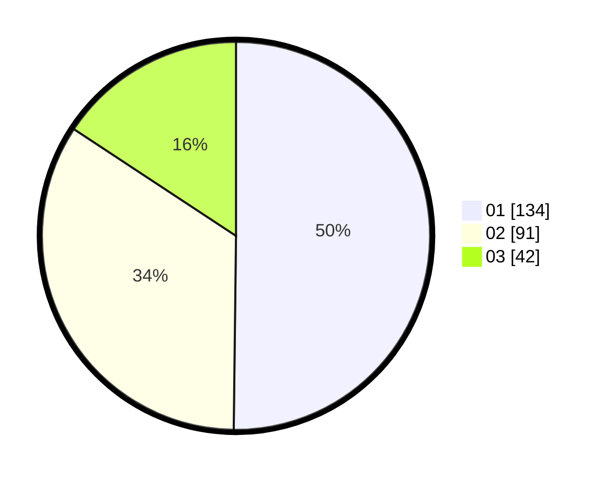

# Hasil

Hasil perolehan suara paslon dapat dilihat pada file paslon-01.txt, paslon-02.txt, dan paslon-03.txt.

Jika tidak ada, artinya data tersebut belum ada pada SIREKAP.

## Perolehan Suara

 * Paslon 01: **134**.
 * Paslon 02: **91**.
 * Paslon 03: **42**.

## Foto C Plano

https://sirekap-obj-formc.kpu.go.id/0ecf/pemilu/ppwp/31/73/08/10/06/3173081006059-20240214-195954--54d7368d-0a31-471e-b890-20291a30201d.jpg

https://sirekap-obj-formc.kpu.go.id/0ecf/pemilu/ppwp/31/73/08/10/06/3173081006059-20240214-192128--cf0fdb1a-838f-4d19-ad18-7b77d70f6b12.jpg

https://sirekap-obj-formc.kpu.go.id/0ecf/pemilu/ppwp/31/73/08/10/06/3173081006059-20240214-200109--42114e7c-eadd-45dc-ba19-ed65ae4d27c0.jpg
