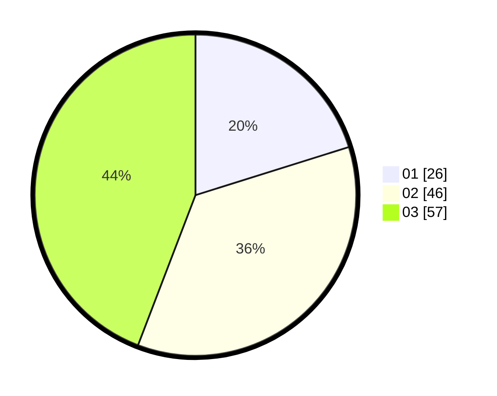

# Hasil

Hasil perolehan suara paslon dapat dilihat pada file paslon-01.txt, paslon-02.txt, dan paslon-03.txt.

Jika tidak ada, artinya data tersebut belum ada pada SIREKAP.

## Perolehan Suara

 * Paslon 01: **26**.
 * Paslon 02: **46**.
 * Paslon 03: **57**.

## Foto C Plano

https://sirekap-obj-formc.kpu.go.id/1906/pemilu/ppwp/31/73/08/10/06/3173081006061-20240216-140152--6c259a02-1724-496e-9916-af08d0b104b4.jpg

https://sirekap-obj-formc.kpu.go.id/1906/pemilu/ppwp/31/73/08/10/06/3173081006061-20240216-140154--9b265d89-4324-46b9-9a17-896c24d8d064.jpg

https://sirekap-obj-formc.kpu.go.id/1906/pemilu/ppwp/31/73/08/10/06/3173081006061-20240216-140153--d3a1129b-6d71-4f1c-8cbe-33dfcb218ac2.jpg

## DATA PEMILIH TETAP

Jumlah pemilih dalam DPT: **150**.
 * L: **66**.
 * P: **84**.

## DATA PENGGUNA HAK PILIH

Jumlah pengguna hak pilih dalam DPT: **121**.
 * L: **55**.
 * P: **66**.

Jumlah pengguna hak pilih dalam DPTb: **9**.
 * L: **1**.
 * P: **8**.

Jumlah pengguna hak pilih dalam DPK: **1**.
 * L: **1**.
 * P: **0**.

Jumlah pengguna hak pilih: **131**.
 * L: **57**.
 * P: **74**.

## JUMLAH SUARA SAH DAN TIDAK SAH

JUMLAH SELURUH SUARA SAH: **129**.

JUMLAH SUARA TIDAK SAH: **2**.

JUMLAH SELURUH SUARA SAH DAN SUARA TIDAK SAH: **131**.
