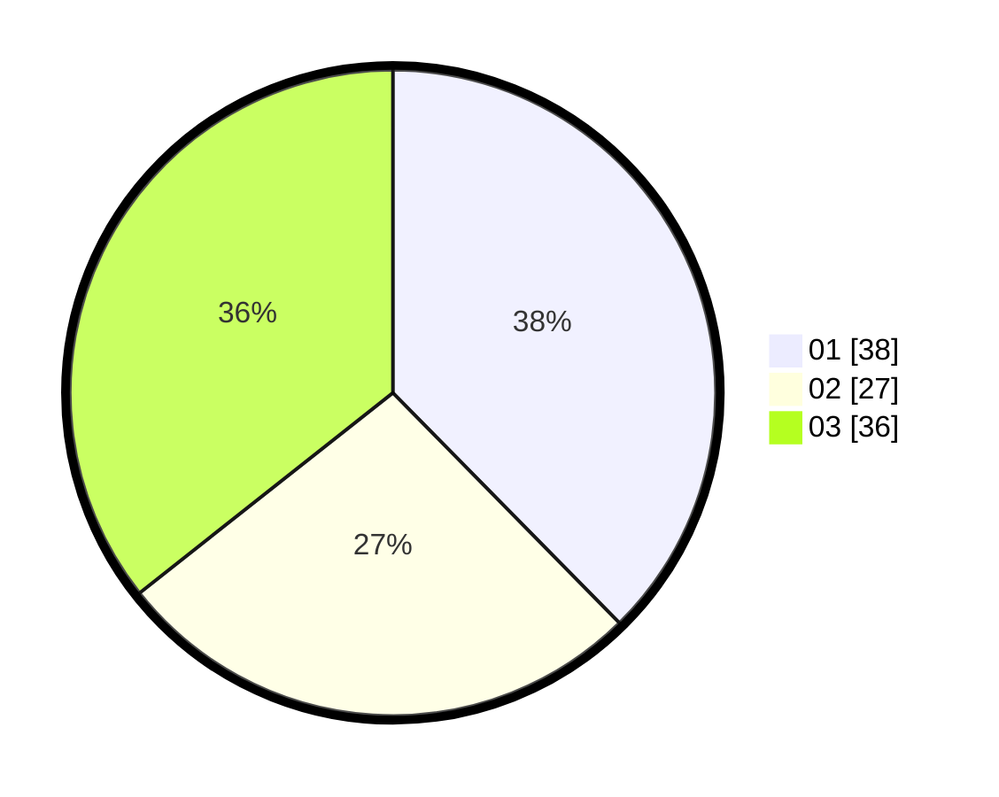

# Hasil

Hasil perolehan suara paslon dapat dilihat pada file paslon-01.txt, paslon-02.txt, dan paslon-03.txt.

Jika tidak ada, artinya data tersebut belum ada pada SIREKAP.

## Perolehan Suara

 * Paslon 01: **38**.
 * Paslon 02: **27**.
 * Paslon 03: **36**.

## Foto C Plano

https://sirekap-obj-formc.kpu.go.id/a639/pemilu/ppwp/31/73/08/10/06/3173081006063-20240214-210529--6bcffce3-65a7-4ee9-8071-d2ef67ccdbba.jpg

https://sirekap-obj-formc.kpu.go.id/a639/pemilu/ppwp/31/73/08/10/06/3173081006063-20240214-210850--268a619f-edf2-471c-8669-9c94c792b13f.jpg

https://sirekap-obj-formc.kpu.go.id/a639/pemilu/ppwp/31/73/08/10/06/3173081006063-20240214-211135--733d7097-bf09-47ce-a66e-d9860b82f2c9.jpg

## DATA PEMILIH TETAP

Jumlah pemilih dalam DPT: **121**.
 * L: **60**.
 * P: **61**.

## DATA PENGGUNA HAK PILIH

Jumlah pengguna hak pilih dalam DPT: **96**.
 * L: **46**.
 * P: **50**.

Jumlah pengguna hak pilih dalam DPTb: **5**.
 * L: **1**.
 * P: **4**.

Jumlah pengguna hak pilih dalam DPK: **2**.
 * L: **1**.
 * P: **1**.

Jumlah pengguna hak pilih: **103**.
 * L: **48**.
 * P: **55**.

## JUMLAH SUARA SAH DAN TIDAK SAH

JUMLAH SELURUH SUARA SAH: **101**.

JUMLAH SUARA TIDAK SAH: **2**.

JUMLAH SELURUH SUARA SAH DAN SUARA TIDAK SAH: **103**.
