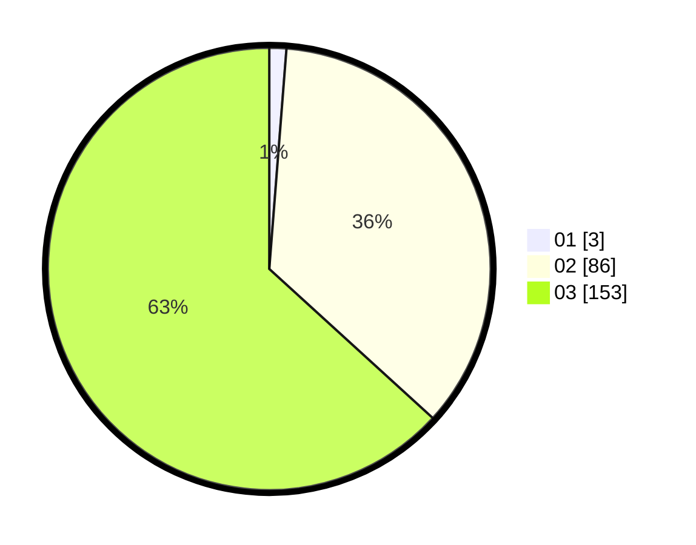

# Hasil

Hasil perolehan suara paslon dapat dilihat pada file paslon-01.txt, paslon-02.txt, dan paslon-03.txt.

Jika tidak ada, artinya data tersebut belum ada pada SIREKAP.

## Perolehan Suara

 * Paslon 01: **3**.
 * Paslon 02: **86**.
 * Paslon 03: **153**.

## Foto C Plano

https://sirekap-obj-formc.kpu.go.id/dc2f/pemilu/ppwp/31/73/08/10/06/3173081006064-20240214-195512--1c70f985-22db-4b53-8373-4b5acce15f73.jpg

https://sirekap-obj-formc.kpu.go.id/dc2f/pemilu/ppwp/31/73/08/10/06/3173081006064-20240214-195743--ae99488f-2793-45b5-a046-96b536f49b3c.jpg

https://sirekap-obj-formc.kpu.go.id/dc2f/pemilu/ppwp/31/73/08/10/06/3173081006064-20240214-195700--dde77a6c-eadc-4ddf-bc74-785683101e16.jpg

## DATA PEMILIH TETAP

Jumlah pemilih dalam DPT: **278**.
 * L: **134**.
 * P: **144**.

## DATA PENGGUNA HAK PILIH

Jumlah pengguna hak pilih dalam DPT: **218**.
 * L: **104**.
 * P: **114**.

Jumlah pengguna hak pilih dalam DPTb: **17**.
 * L: **5**.
 * P: **12**.

Jumlah pengguna hak pilih dalam DPK: **8**.
 * L: **3**.
 * P: **5**.

Jumlah pengguna hak pilih: **243**.
 * L: **112**.
 * P: **131**.

## JUMLAH SUARA SAH DAN TIDAK SAH

JUMLAH SELURUH SUARA SAH: **242**.

JUMLAH SUARA TIDAK SAH: **1**.

JUMLAH SELURUH SUARA SAH DAN SUARA TIDAK SAH: **243**.
