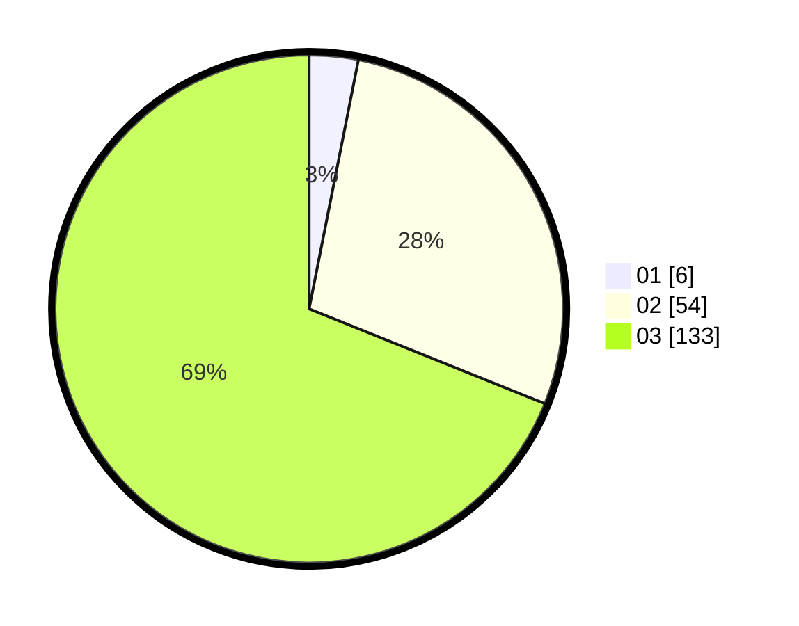

# Hasil

Hasil perolehan suara paslon dapat dilihat pada file paslon-01.txt, paslon-02.txt, dan paslon-03.txt.

Jika tidak ada, artinya data tersebut belum ada pada SIREKAP.

## Perolehan Suara

 * Paslon 01: **6**.
 * Paslon 02: **54**.
 * Paslon 03: **133**.

## Foto C Plano

https://sirekap-obj-formc.kpu.go.id/19cb/pemilu/ppwp/31/73/08/10/06/3173081006067-20240214-192111--c94b86e0-c233-43e8-be47-d272b2e3164b.jpg

https://sirekap-obj-formc.kpu.go.id/19cb/pemilu/ppwp/31/73/08/10/06/3173081006067-20240214-192126--51b76cb5-8e97-4d48-8567-164fff461414.jpg

https://sirekap-obj-formc.kpu.go.id/19cb/pemilu/ppwp/31/73/08/10/06/3173081006067-20240214-192141--5d1d1e97-e542-4007-a3c2-1133f51b256a.jpg

## DATA PEMILIH TETAP

Jumlah pemilih dalam DPT: **226**.
 * L: **109**.
 * P: **117**.

## DATA PENGGUNA HAK PILIH

Jumlah pengguna hak pilih dalam DPT: **169**.
 * L: **81**.
 * P: **88**.

Jumlah pengguna hak pilih dalam DPTb: **18**.
 * L: **3**.
 * P: **15**.

Jumlah pengguna hak pilih dalam DPK: **7**.
 * L: **4**.
 * P: **3**.

Jumlah pengguna hak pilih: **194**.
 * L: **88**.
 * P: **106**.

## JUMLAH SUARA SAH DAN TIDAK SAH

JUMLAH SELURUH SUARA SAH: **293**.

JUMLAH SUARA TIDAK SAH: **1**.

JUMLAH SELURUH SUARA SAH DAN SUARA TIDAK SAH: **194**.
