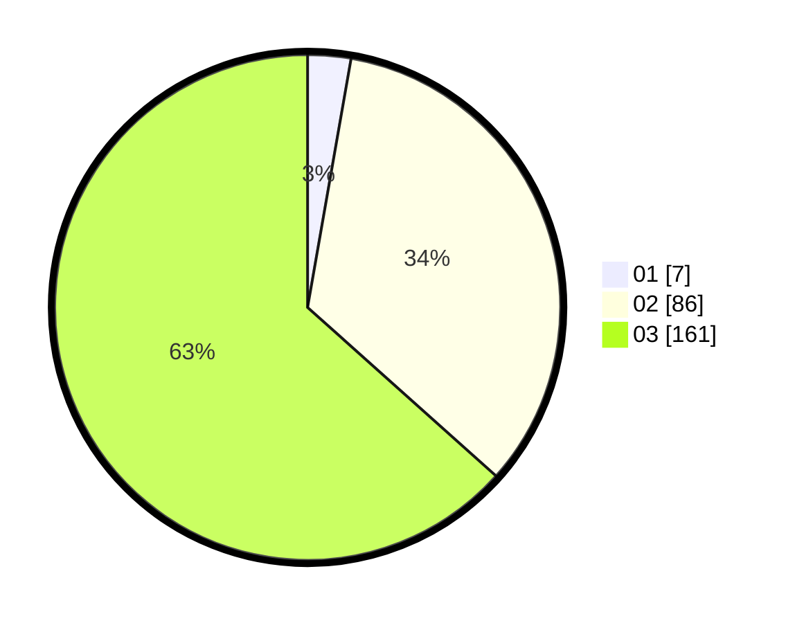

# Hasil

Hasil perolehan suara paslon dapat dilihat pada file paslon-01.txt, paslon-02.txt, dan paslon-03.txt.

Jika tidak ada, artinya data tersebut belum ada pada SIREKAP.

## Perolehan Suara

 * Paslon 01: **7**.
 * Paslon 02: **86**.
 * Paslon 03: **161**.

## Foto C Plano

https://sirekap-obj-formc.kpu.go.id/54d1/pemilu/ppwp/31/73/08/10/06/3173081006068-20240214-211029--793bd5ec-2aa4-40c6-8e11-c933a432deb6.jpg

https://sirekap-obj-formc.kpu.go.id/54d1/pemilu/ppwp/31/73/08/10/06/3173081006068-20240214-155859--caf756cb-2d9e-40e6-a17b-03ad30638b65.jpg

https://sirekap-obj-formc.kpu.go.id/54d1/pemilu/ppwp/31/73/08/10/06/3173081006068-20240214-211043--f4a33c80-e39d-4056-b369-f543fef234c7.jpg
