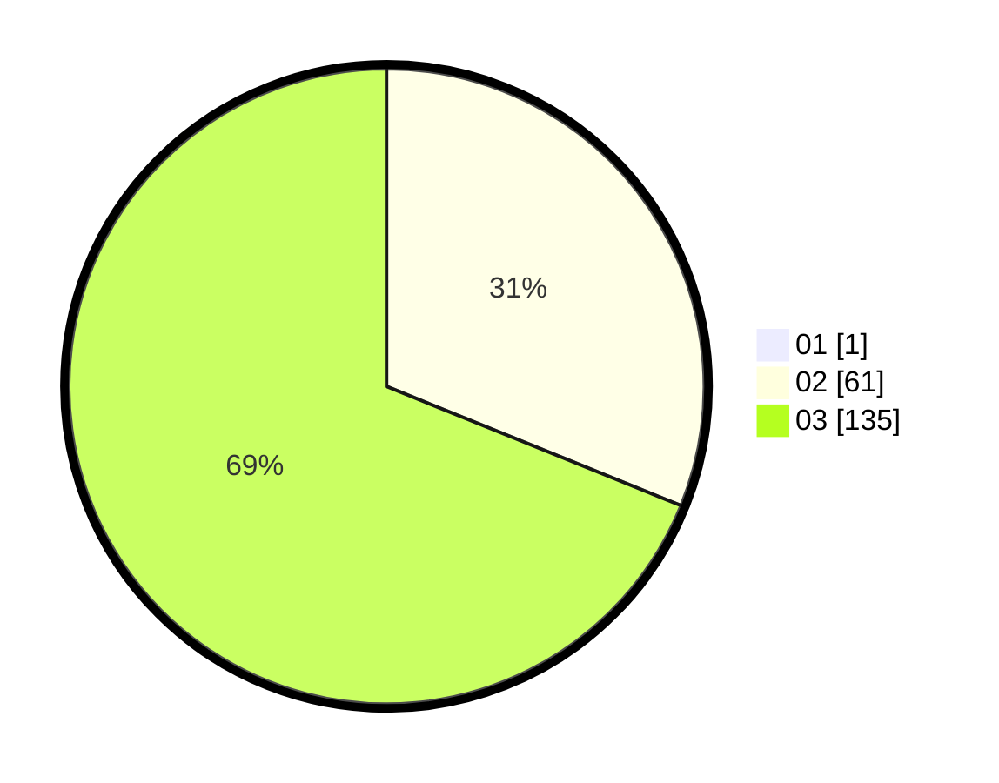

# Hasil

Hasil perolehan suara paslon dapat dilihat pada file paslon-01.txt, paslon-02.txt, dan paslon-03.txt.

Jika tidak ada, artinya data tersebut belum ada pada SIREKAP.

## Perolehan Suara

 * Paslon 01: **1**.
 * Paslon 02: **61**.
 * Paslon 03: **135**.

## Foto C Plano

https://sirekap-obj-formc.kpu.go.id/f206/pemilu/ppwp/31/73/08/10/06/3173081006069-20240214-212253--72391739-13aa-468d-a246-1266fb2b013a.jpg

https://sirekap-obj-formc.kpu.go.id/f206/pemilu/ppwp/31/73/08/10/06/3173081006069-20240214-212324--0029f90b-b808-4359-ae74-c3c2e567a29e.jpg

https://sirekap-obj-formc.kpu.go.id/f206/pemilu/ppwp/31/73/08/10/06/3173081006069-20240214-212356--26a909ce-35ed-45f3-b08e-fefde775259f.jpg
