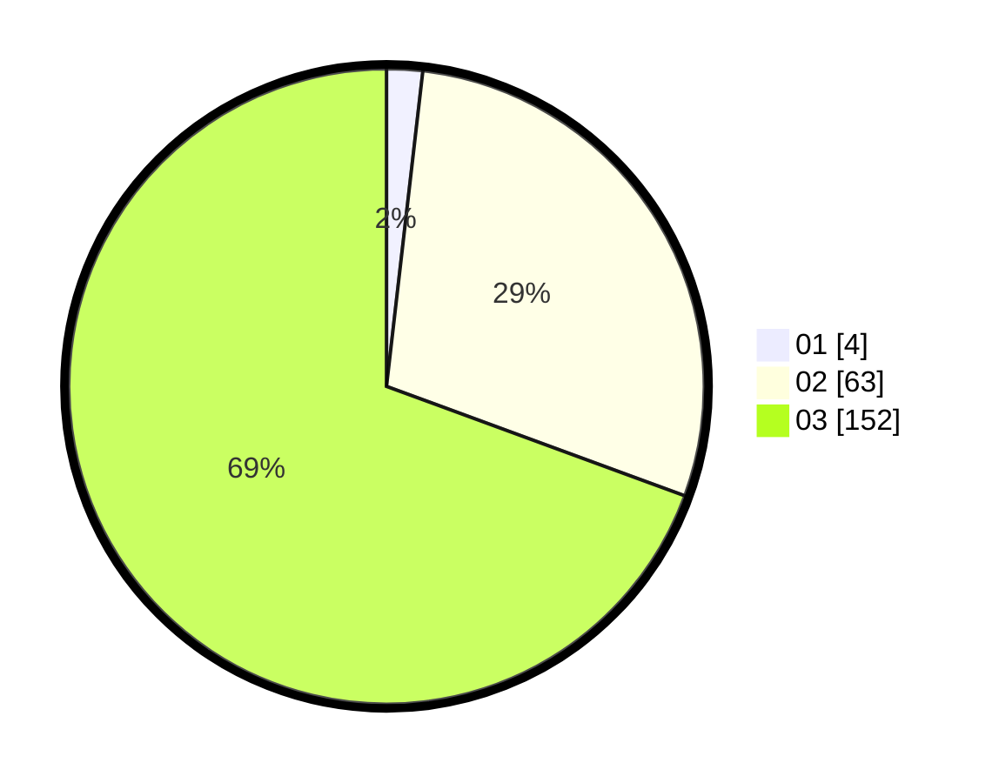

# Hasil

Hasil perolehan suara paslon dapat dilihat pada file paslon-01.txt, paslon-02.txt, dan paslon-03.txt.

Jika tidak ada, artinya data tersebut belum ada pada SIREKAP.

## Perolehan Suara

 * Paslon 01: **4**.
 * Paslon 02: **63**.
 * Paslon 03: **152**.

## Foto C Plano

https://sirekap-obj-formc.kpu.go.id/de00/pemilu/ppwp/31/73/08/10/06/3173081006070-20240214-212210--ca53771b-f3b5-4789-8dcf-0772714eff17.jpg

https://sirekap-obj-formc.kpu.go.id/de00/pemilu/ppwp/31/73/08/10/06/3173081006070-20240214-212217--0743a799-0d1b-4a7e-b42f-ff9f906fda66.jpg

https://sirekap-obj-formc.kpu.go.id/de00/pemilu/ppwp/31/73/08/10/06/3173081006070-20240214-212222--62935edd-77fd-47c3-bdd9-50b91695719a.jpg
