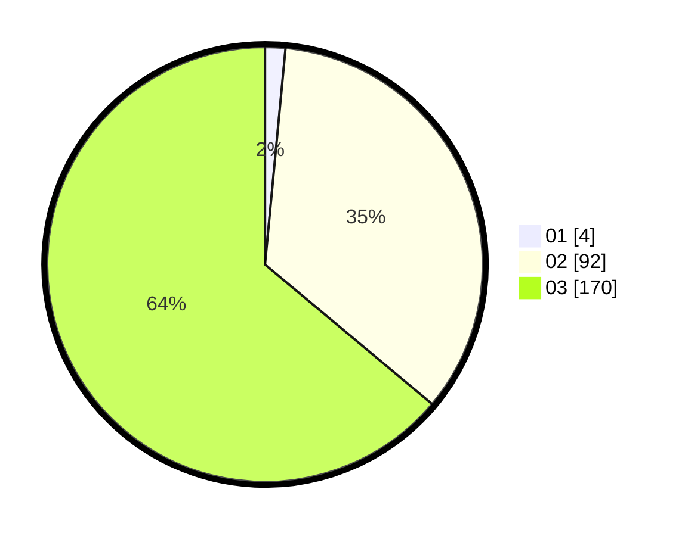

# Hasil

Hasil perolehan suara paslon dapat dilihat pada file paslon-01.txt, paslon-02.txt, dan paslon-03.txt.

Jika tidak ada, artinya data tersebut belum ada pada SIREKAP.

## Perolehan Suara

 * Paslon 01: **4**.
 * Paslon 02: **92**.
 * Paslon 03: **170**.

## Foto C Plano

https://sirekap-obj-formc.kpu.go.id/901a/pemilu/ppwp/31/73/08/10/06/3173081006071-20240214-192945--198137b8-08a0-450f-aea6-861026829792.jpg

https://sirekap-obj-formc.kpu.go.id/901a/pemilu/ppwp/31/73/08/10/06/3173081006071-20240214-192949--008a38ab-a3ae-4586-bfb1-64a950201803.jpg

https://sirekap-obj-formc.kpu.go.id/901a/pemilu/ppwp/31/73/08/10/06/3173081006071-20240214-192953--c9d45737-b11b-42ac-b402-d66fddeff424.jpg
