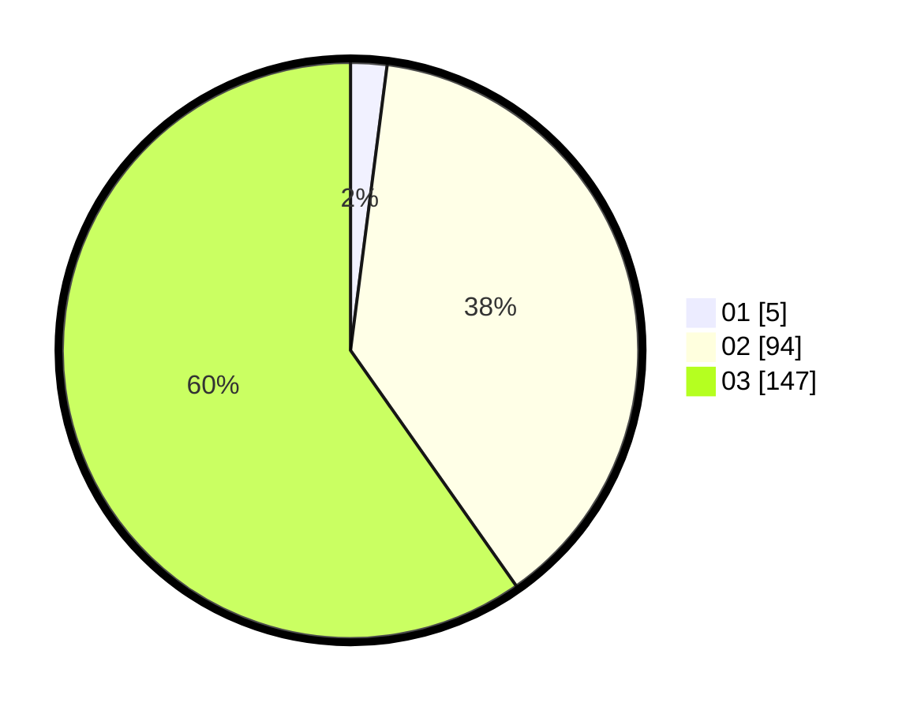

# Hasil

Hasil perolehan suara paslon dapat dilihat pada file paslon-01.txt, paslon-02.txt, dan paslon-03.txt.

Jika tidak ada, artinya data tersebut belum ada pada SIREKAP.

## Perolehan Suara

 * Paslon 01: **5**.
 * Paslon 02: **94**.
 * Paslon 03: **147**.

## Foto C Plano

https://sirekap-obj-formc.kpu.go.id/71d5/pemilu/ppwp/31/73/08/10/06/3173081006077-20240214-205909--cecd8a91-65ed-4342-a472-6f39a28913f2.jpg

https://sirekap-obj-formc.kpu.go.id/71d5/pemilu/ppwp/31/73/08/10/06/3173081006077-20240214-205937--2928a0cd-2bc1-49a8-bdbc-6bb681b561b8.jpg

https://sirekap-obj-formc.kpu.go.id/71d5/pemilu/ppwp/31/73/08/10/06/3173081006077-20240214-210011--d5b702c6-32ca-414a-a3bf-c0a49e9afe20.jpg

## DATA PEMILIH TETAP

Jumlah pemilih dalam DPT: **294**.
 * L: **135**.
 * P: **159**.

## DATA PENGGUNA HAK PILIH

Jumlah pengguna hak pilih dalam DPT: **224**.
 * L: **92**.
 * P: **132**.

Jumlah pengguna hak pilih dalam DPTb: **22**.
 * L: **2**.
 * P: **20**.

Jumlah pengguna hak pilih dalam DPK: **1**.
 * L: **0**.
 * P: **1**.

Jumlah pengguna hak pilih: **247**.
 * L: **94**.
 * P: **153**.

## JUMLAH SUARA SAH DAN TIDAK SAH

JUMLAH SELURUH SUARA SAH: **246**.

JUMLAH SUARA TIDAK SAH: **1**.

JUMLAH SELURUH SUARA SAH DAN SUARA TIDAK SAH: **247**.
