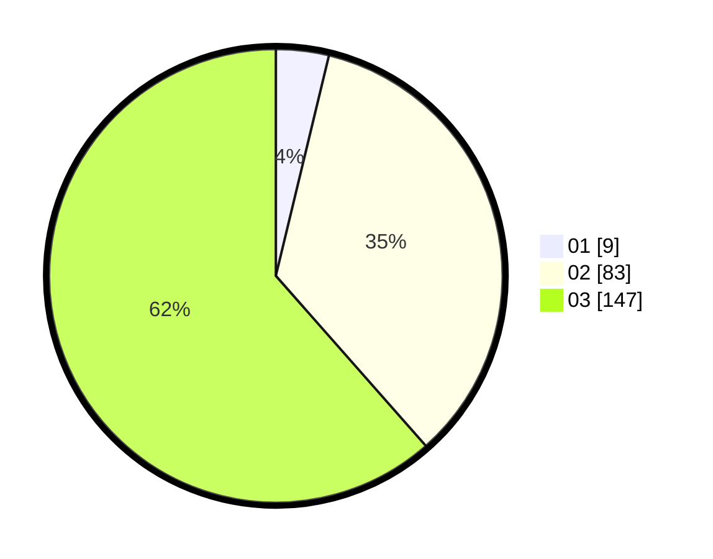

# Hasil

Hasil perolehan suara paslon dapat dilihat pada file paslon-01.txt, paslon-02.txt, dan paslon-03.txt.

Jika tidak ada, artinya data tersebut belum ada pada SIREKAP.

## Perolehan Suara

 * Paslon 01: **9**.
 * Paslon 02: **83**.
 * Paslon 03: **147**.

## Foto C Plano

https://sirekap-obj-formc.kpu.go.id/4330/pemilu/ppwp/31/73/08/10/06/3173081006079-20240214-210656--fe02447c-67f6-464d-affc-817f10bda11e.jpg

https://sirekap-obj-formc.kpu.go.id/4330/pemilu/ppwp/31/73/08/10/06/3173081006079-20240214-210705--e6368714-680d-4c6d-b116-59114b5193bc.jpg

https://sirekap-obj-formc.kpu.go.id/4330/pemilu/ppwp/31/73/08/10/06/3173081006079-20240214-210710--364a95ea-a6a6-4164-9d93-dd5103fe800f.jpg

## DATA PEMILIH TETAP

Jumlah pemilih dalam DPT: **281**.
 * L: **131**.
 * P: **150**.

## DATA PENGGUNA HAK PILIH

Jumlah pengguna hak pilih dalam DPT: **223**.
 * L: **107**.
 * P: **116**.

Jumlah pengguna hak pilih dalam DPTb: **15**.
 * L: **6**.
 * P: **9**.

Jumlah pengguna hak pilih dalam DPK: **3**.
 * L: **1**.
 * P: **2**.

Jumlah pengguna hak pilih: **241**.
 * L: **114**.
 * P: **127**.

## JUMLAH SUARA SAH DAN TIDAK SAH

JUMLAH SELURUH SUARA SAH: **239**.

JUMLAH SUARA TIDAK SAH: **2**.

JUMLAH SELURUH SUARA SAH DAN SUARA TIDAK SAH: **241**.
