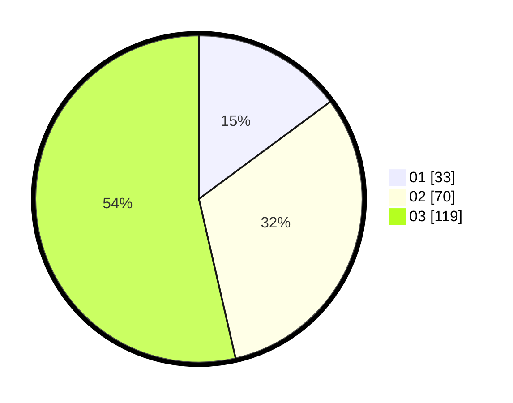

# Hasil

Hasil perolehan suara paslon dapat dilihat pada file paslon-01.txt, paslon-02.txt, dan paslon-03.txt.

Jika tidak ada, artinya data tersebut belum ada pada SIREKAP.

## Perolehan Suara

 * Paslon 01: **33**.
 * Paslon 02: **70**.
 * Paslon 03: **119**.

## Foto C Plano

https://sirekap-obj-formc.kpu.go.id/4335/pemilu/ppwp/31/73/08/10/06/3173081006088-20240214-235055--efd3e72a-0ce6-48fa-a48d-e0ef758ad2f7.jpg

https://sirekap-obj-formc.kpu.go.id/4335/pemilu/ppwp/31/73/08/10/06/3173081006088-20240214-235310--a97b2eac-5555-4c86-bc77-31b66973c62e.jpg

https://sirekap-obj-formc.kpu.go.id/4335/pemilu/ppwp/31/73/08/10/06/3173081006088-20240214-235349--3042dc5c-9b82-4ccd-8460-2bc1f1936ad1.jpg
