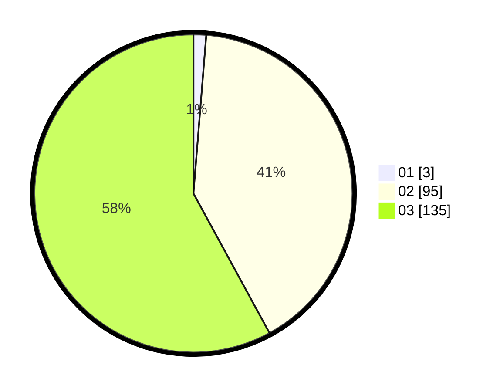

# Hasil

Hasil perolehan suara paslon dapat dilihat pada file paslon-01.txt, paslon-02.txt, dan paslon-03.txt.

Jika tidak ada, artinya data tersebut belum ada pada SIREKAP.

## Perolehan Suara

 * Paslon 01: **3**.
 * Paslon 02: **95**.
 * Paslon 03: **135**.

## Foto C Plano

https://sirekap-obj-formc.kpu.go.id/b92c/pemilu/ppwp/31/73/08/10/06/3173081006089-20240214-195021--e7005e72-01e2-4751-974a-9dac1f4da79c.jpg

https://sirekap-obj-formc.kpu.go.id/b92c/pemilu/ppwp/31/73/08/10/06/3173081006089-20240214-210724--6fa85cfb-215b-4031-a481-93570c9ebc1e.jpg

https://sirekap-obj-formc.kpu.go.id/b92c/pemilu/ppwp/31/73/08/10/06/3173081006089-20240214-195038--6ccf06f2-474e-4631-a69c-f38b57c63886.jpg

## DATA PEMILIH TETAP

Jumlah pemilih dalam DPT: **276**.
 * L: **120**.
 * P: **156**.

## DATA PENGGUNA HAK PILIH

Jumlah pengguna hak pilih dalam DPT: **214**.
 * L: **95**.
 * P: **119**.

Jumlah pengguna hak pilih dalam DPTb: **9**.
 * L: **2**.
 * P: **7**.

Jumlah pengguna hak pilih dalam DPK: **11**.
 * L: **6**.
 * P: **5**.

Jumlah pengguna hak pilih: **234**.
 * L: **105**.
 * P: **131**.

## JUMLAH SUARA SAH DAN TIDAK SAH

JUMLAH SELURUH SUARA SAH: **233**.

JUMLAH SUARA TIDAK SAH: **1**.

JUMLAH SELURUH SUARA SAH DAN SUARA TIDAK SAH: **234**.
