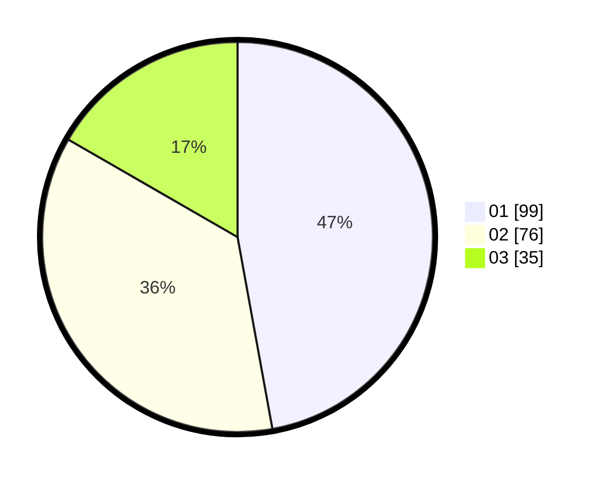

# Hasil

Hasil perolehan suara paslon dapat dilihat pada file paslon-01.txt, paslon-02.txt, dan paslon-03.txt.

Jika tidak ada, artinya data tersebut belum ada pada SIREKAP.

## Perolehan Suara

 * Paslon 01: **99**.
 * Paslon 02: **76**.
 * Paslon 03: **35**.

## Foto C Plano

https://sirekap-obj-formc.kpu.go.id/90ca/pemilu/ppwp/31/73/08/10/06/3173081006090-20240214-235203--9afd9c9c-74cb-4459-9de3-dfae3f066f59.jpg

https://sirekap-obj-formc.kpu.go.id/90ca/pemilu/ppwp/31/73/08/10/06/3173081006090-20240215-000804--34da5dcd-7e36-4413-8fe6-8c5034e3c0cc.jpg

https://sirekap-obj-formc.kpu.go.id/90ca/pemilu/ppwp/31/73/08/10/06/3173081006090-20240215-000455--26876abf-bddd-4c55-b7d2-910049b3bf75.jpg
