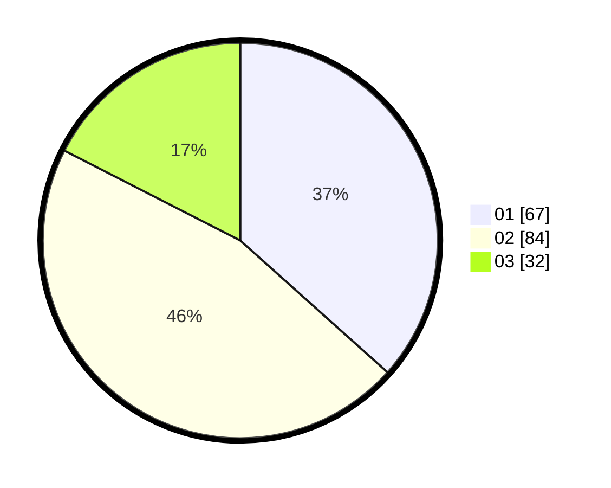

# Hasil

Hasil perolehan suara paslon dapat dilihat pada file paslon-01.txt, paslon-02.txt, dan paslon-03.txt.

Jika tidak ada, artinya data tersebut belum ada pada SIREKAP.

## Perolehan Suara

 * Paslon 01: **67**.
 * Paslon 02: **84**.
 * Paslon 03: **32**.

## Foto C Plano

https://sirekap-obj-formc.kpu.go.id/f331/pemilu/ppwp/31/73/08/10/06/3173081006095-20240215-000041--2f5cf468-ad9c-4860-a614-737e5a9ac7b7.jpg

https://sirekap-obj-formc.kpu.go.id/f331/pemilu/ppwp/31/73/08/10/06/3173081006095-20240215-000254--8e366acf-4faa-4cc4-993c-dcb75efd5a7e.jpg

https://sirekap-obj-formc.kpu.go.id/f331/pemilu/ppwp/31/73/08/10/06/3173081006095-20240215-000452--6efd13c4-f0bc-4662-9472-1377ad788fdb.jpg
