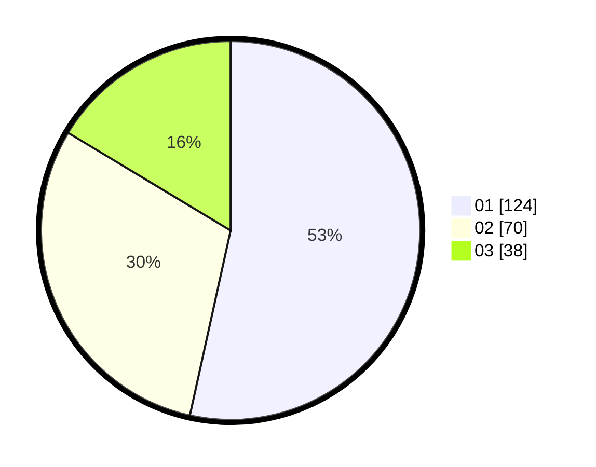

# Hasil

Hasil perolehan suara paslon dapat dilihat pada file paslon-01.txt, paslon-02.txt, dan paslon-03.txt.

Jika tidak ada, artinya data tersebut belum ada pada SIREKAP.

## Perolehan Suara

 * Paslon 01: **124**.
 * Paslon 02: **70**.
 * Paslon 03: **38**.

## Foto C Plano

https://sirekap-obj-formc.kpu.go.id/8ea2/pemilu/ppwp/31/74/01/10/01/3174011001002-20240216-025454--ad1c0dae-d723-4c91-9093-ece92485e5b2.jpg

https://sirekap-obj-formc.kpu.go.id/8ea2/pemilu/ppwp/31/74/01/10/01/3174011001002-20240214-184458--fc72d158-2c06-4581-9135-2daecc163b15.jpg

https://sirekap-obj-formc.kpu.go.id/8ea2/pemilu/ppwp/31/74/01/10/01/3174011001002-20240214-185423--e0d1be8e-094d-4ac0-8570-be97d8a257b6.jpg

## DATA PEMILIH TETAP

Jumlah pemilih dalam DPT: **286**.
 * L: **138**.
 * P: **148**.

## DATA PENGGUNA HAK PILIH

Jumlah pengguna hak pilih dalam DPT: **227**.
 * L: **107**.
 * P: **120**.

Jumlah pengguna hak pilih dalam DPTb: **10**.
 * L: **3**.
 * P: **7**.

Jumlah pengguna hak pilih dalam DPK: **1**.
 * L: **1**.
 * P: **0**.

Jumlah pengguna hak pilih: **238**.
 * L: **111**.
 * P: **127**.

## JUMLAH SUARA SAH DAN TIDAK SAH

JUMLAH SELURUH SUARA SAH: **232**.

JUMLAH SUARA TIDAK SAH: **6**.

JUMLAH SELURUH SUARA SAH DAN SUARA TIDAK SAH: **238**.
