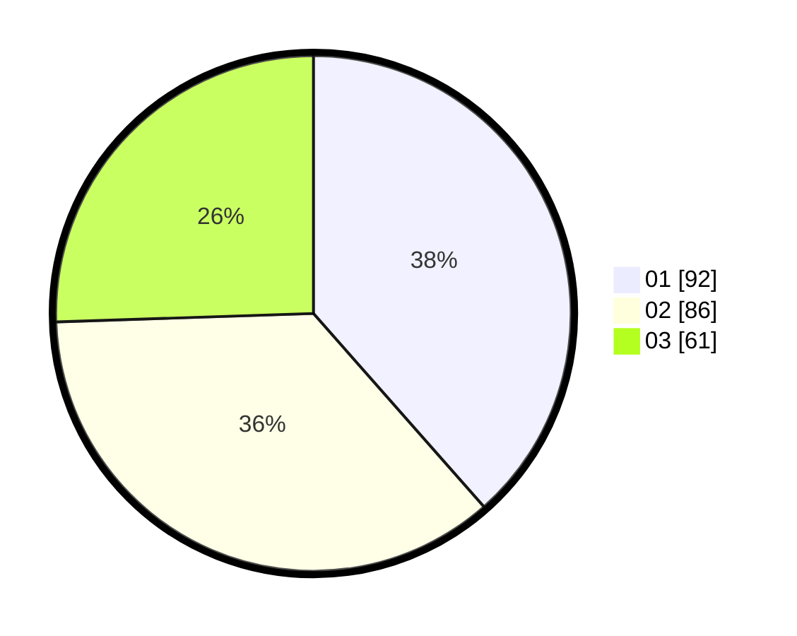

# Hasil

Hasil perolehan suara paslon dapat dilihat pada file paslon-01.txt, paslon-02.txt, dan paslon-03.txt.

Jika tidak ada, artinya data tersebut belum ada pada SIREKAP.

## Perolehan Suara

 * Paslon 01: **92**.
 * Paslon 02: **86**.
 * Paslon 03: **61**.

## Foto C Plano

https://sirekap-obj-formc.kpu.go.id/4675/pemilu/ppwp/31/74/01/10/01/3174011001011-20240214-155911--93f63b92-df24-4f6d-a121-74d030c25ce3.jpg

https://sirekap-obj-formc.kpu.go.id/4675/pemilu/ppwp/31/74/01/10/01/3174011001011-20240214-193452--fb03cd17-c3c1-48cd-a877-4d734d18aff8.jpg

https://sirekap-obj-formc.kpu.go.id/4675/pemilu/ppwp/31/74/01/10/01/3174011001011-20240214-160120--9ab992e1-6c2c-4505-b1fa-38507a98ef94.jpg

## DATA PEMILIH TETAP

Jumlah pemilih dalam DPT: **268**.
 * L: **119**.
 * P: **149**.

## DATA PENGGUNA HAK PILIH

Jumlah pengguna hak pilih dalam DPT: **229**.
 * L: **102**.
 * P: **127**.

Jumlah pengguna hak pilih dalam DPTb: **14**.
 * L: **5**.
 * P: **9**.

Jumlah pengguna hak pilih dalam DPK: **2**.
 * L: **2**.
 * P: **0**.

Jumlah pengguna hak pilih: **245**.
 * L: **109**.
 * P: **136**.

## JUMLAH SUARA SAH DAN TIDAK SAH

JUMLAH SELURUH SUARA SAH: **239**.

JUMLAH SUARA TIDAK SAH: **6**.

JUMLAH SELURUH SUARA SAH DAN SUARA TIDAK SAH: **245**.
