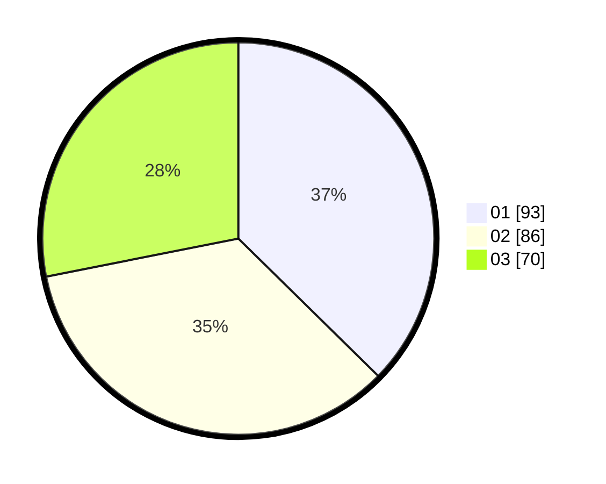

# Hasil

Hasil perolehan suara paslon dapat dilihat pada file paslon-01.txt, paslon-02.txt, dan paslon-03.txt.

Jika tidak ada, artinya data tersebut belum ada pada SIREKAP.

## Perolehan Suara

 * Paslon 01: **93**.
 * Paslon 02: **86**.
 * Paslon 03: **70**.

## Foto C Plano

https://sirekap-obj-formc.kpu.go.id/ece9/pemilu/ppwp/31/74/01/10/01/3174011001012-20240214-155248--eee298de-0a1f-441c-be88-b3dc2da145c2.jpg

https://sirekap-obj-formc.kpu.go.id/ece9/pemilu/ppwp/31/74/01/10/01/3174011001012-20240214-155412--89e218e9-2ea3-4a73-a817-5e87ef7d763f.jpg

https://sirekap-obj-formc.kpu.go.id/ece9/pemilu/ppwp/31/74/01/10/01/3174011001012-20240214-155346--72904075-dc74-43cb-8a9d-f50057a5643c.jpg

## DATA PEMILIH TETAP

Jumlah pemilih dalam DPT: **288**.
 * L: **141**.
 * P: **147**.

## DATA PENGGUNA HAK PILIH

Jumlah pengguna hak pilih dalam DPT: **228**.
 * L: **111**.
 * P: **117**.

Jumlah pengguna hak pilih dalam DPTb: **18**.
 * L: **8**.
 * P: **10**.

Jumlah pengguna hak pilih dalam DPK: **7**.
 * L: **2**.
 * P: **5**.

Jumlah pengguna hak pilih: **253**.
 * L: **121**.
 * P: **132**.

## JUMLAH SUARA SAH DAN TIDAK SAH

JUMLAH SELURUH SUARA SAH: **249**.

JUMLAH SUARA TIDAK SAH: **4**.

JUMLAH SELURUH SUARA SAH DAN SUARA TIDAK SAH: **253**.
