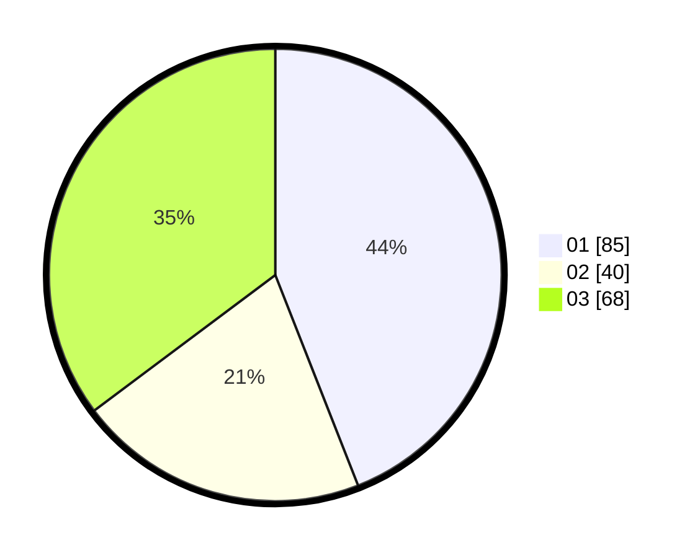

# Hasil

Hasil perolehan suara paslon dapat dilihat pada file paslon-01.txt, paslon-02.txt, dan paslon-03.txt.

Jika tidak ada, artinya data tersebut belum ada pada SIREKAP.

## Perolehan Suara

 * Paslon 01: **85**.
 * Paslon 02: **40**.
 * Paslon 03: **68**.

## Foto C Plano

https://sirekap-obj-formc.kpu.go.id/69b3/pemilu/ppwp/31/74/01/10/01/3174011001013-20240214-202725--950d6303-e5de-409e-8537-adaefc6154af.jpg

https://sirekap-obj-formc.kpu.go.id/69b3/pemilu/ppwp/31/74/01/10/01/3174011001013-20240214-202741--8b4dbfd0-de42-4d9a-9c52-454f656955b3.jpg

https://sirekap-obj-formc.kpu.go.id/69b3/pemilu/ppwp/31/74/01/10/01/3174011001013-20240215-004034--b80cb845-dd78-4f16-93f3-8e45d18a4bbc.jpg

## DATA PEMILIH TETAP

Jumlah pemilih dalam DPT: **211**.
 * L: **102**.
 * P: **109**.

## DATA PENGGUNA HAK PILIH

Jumlah pengguna hak pilih dalam DPT: **174**.
 * L: **83**.
 * P: **91**.

Jumlah pengguna hak pilih dalam DPTb: **19**.
 * L: **3**.
 * P: **16**.

Jumlah pengguna hak pilih dalam DPK: **3**.
 * L: **1**.
 * P: **2**.

Jumlah pengguna hak pilih: **196**.
 * L: **87**.
 * P: **109**.

## JUMLAH SUARA SAH DAN TIDAK SAH

JUMLAH SELURUH SUARA SAH: **193**.

JUMLAH SUARA TIDAK SAH: **3**.

JUMLAH SELURUH SUARA SAH DAN SUARA TIDAK SAH: **196**.
